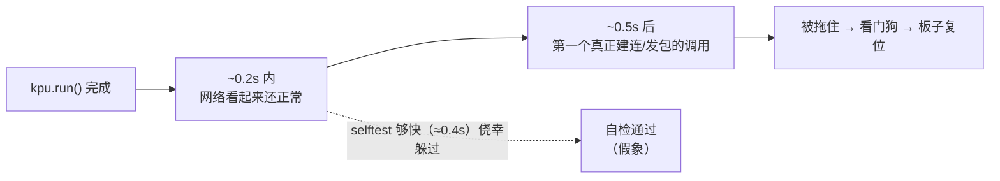

# K230 病害识别 kmodel 转换与部署手册

> 状态：**链路已跑通**（2026-10-02 13:20 端到端实证：结论入库 + 图片入库 + App 有图，
> 脚本 `v13-enc-save-first`）。`model.kmodel` = **3.48MB / 2 段 / uint8 输入**，
> 板上 `kpu.run()` ≈ **3 ms**。
> ⚠️ **但 KPU 模型的精度仍未验证**（早期那句"100% 一致"是在一个没有 KPU 段的旧模型上测的，已作废），
> 详见 §四 的「★ 精度验证的现状」。本文档记录完整流程 + 所有踩过的坑，照章可复现。
> ⚠️ **抓拍画质仍有一个未解决的坑**：`to_jpeg()` 对 CHN0 的 YUV420SP 会**静默**产出
> RGB565 花屏（魔数合法、尺寸 640×480，但画面是绿/品红），v13 已把编码改成 `save()` 优先，
> **待上板验证**；详见 §五 与 `k230_classify._encode_jpeg()` 的说明。

---

## 一、总览：这段路在干什么

```
PC 上训练好的 model.tflite (float32, 12.4MB)
        │  ① nncase 编译（含 int8 量化）
        ▼
   model.kmodel (int8, 3.48MB / 2 段 / uint8 输入)
        │  ② 拷到 K230 的 /sdcard/
        ▼
K230 摄像头 → PipeLine 直出 224×224 → 预处理(转置,不除255) → KPU 跑 kmodel → top1
            → 抓拍(CHN0 零转换→JPEG) → 串口/HTTP 上报 → Flask 入库 → APP 通知
```

**关键认知：K230 和 PC 跑的是两套模型文件**（`.kmodel` 和 `.tflite`），
但必须是**同一个训练产物**转出来的，否则两边判定会不一致。

---

## 二、版本对应关系（最重要，选错必然失败）

| CanMV 固件 | 对应 nncase 版本 |
|---|---|
| 0.7.0 / 1.0.0 | 2.8.3 |
| **1.1.0 及之后（含我们的 v1.8）** | **2.9.0** |

**我们的板子**：`CanMV v1.8-0-gc2d1f5c` → 用 **nncase 2.9.0** ✅

> ⚠️ kmodel 与设备端运行时版本必须匹配。用错版本，K230 加载 kmodel 时会报错。

---

## 三、环境搭建（Windows）

### 3.1 一键脚本

```bat
cd app\AI_Model\k230
setup_nncase.bat
```

脚本会依次完成 6 步。下面解释**每一步为什么必要**——因为这几步全是坑。

### 3.2 坑 ①：nncase 2.9.0 装不进 Python 3.11

nncase 2.9.0 的 whl **最高只到 cp310**。本机是 Python 3.11，
`pip install nncase==2.9.0` 会直接报 `No matching distribution found`。

**解法**：单独建一个 Python 3.10 环境。

```bash
uv python install 3.10
uv venv --python 3.10 .venv-nncase
```

> 本机 `uv` 已可用（`C:\Users\Twilight\.local\bin\uv`）。
> 没有 uv 就手动装 Python 3.10。

### 3.3 坑 ②：PyPI 上没有 nncase 2.9.0

PyPI 只有 **2.10.0 / 2.11.0**。2.9.0 必须从 **GitHub Release** 下：

```
https://github.com/kendryte/nncase/releases/tag/v2.9.0
```

需要的两个文件（已放在 `whl/` 目录）：

| 文件 | 大小 | 说明 |
|---|---|---|
| `nncase-2.9.0-cp310-cp310-win_amd64.whl` | 19.9MB | 主包，编译器 |
| `nncase_kpu-2.9.0-cp310-cp310-win_amd64.whl` | 1.6MB | KPU 后端（k230 target） |

> **GitHub 被代理挡住时**：本机 `https_proxy` 允许 PyPI 但挡 GitHub。
> 可行的绕法是改用 kendryte 官方资料站，或让别的机器下好传过来。
> 本仓库 `whl/` 里已经放好了，不用再下。

### 3.4 坑 ③：nncase_kpu 的 whl 打包有 bug

官方那个 `nncase_kpu-2.9.0-py2.py3-none-win_amd64.whl` **装不上**，报
`No .dist-info directory found` / `invalid package format`。

**原因**：文件名里的标签是 `py2.py3`（**点**），而 wheel 规范要求用 `-`（`py2.py3` 应为 `py2-py3`），
解析器直接判定格式非法。而包内部 `WHEEL` 文件写的又是 `py2 + py3` 两个 tag。

**解法**：重建一份标签正确的 whl —— 把 WHEEL 里的 tag 改成 `cp310-cp310-win_amd64`，
文件名同步改成 `nncase_kpu-2.9.0-cp310-cp310-win_amd64.whl`。
本仓库 `whl/` 里的**就是修好的那份**，直接用即可。

### 3.5 坑 ④：`libomp140.x86_64.dll` 缺失

装完后 `import _nncase` 报：

```
ImportError: DLL load failed while importing _nncase: 找不到指定的模块。
```

**根因**（用 PE 导入表解析出来的）：
`Nncase.Runtime.Native.dll` 依赖 `libomp140.x86_64.dll`，系统里没有。

官方文档说要把它复制到 `C:\Windows\System32`（**需要管理员权限**）。

**更省事的解法（实测有效）**：直接放在 `site-packages` 同目录下，
Windows 会在 DLL 所在目录查找依赖，**免管理员权限**。

```bash
cp whl/libomp140.x86_64.dll .venv-nncase/Lib/site-packages/
```

> DLL 从哪来：`pip download intel-openmp`，解包后
> `intel_openmp-*.data/data/Library/bin/libiomp5md.dll` 即等价物（已备在 `whl/`）。

### 3.6 坑 ⑤：`CompileOptions()` **段错误**（最阴的一个）

`import _nncase` 成功、`dir(_nncase)` 正常，但一执行：

```python
o = _nncase.CompileOptions()     # 直接 Segmentation fault，没有任何 Python 异常！
```

**根因**：`nncase` 包在 `__init__.py` 里会调用

```python
_nncase.initialize(os.getenv("NNCASE_COMPILER") or ".../nncase/Nncase.Compiler.dll")
```

来启动 .NET hostfxr。如果 `Nncase.Compiler.dll` 找不到，
底层是**访问违例崩溃**，而不是抛 Python 异常 —— 所以看不到任何错误信息。

**解法**：在 import 之前显式设置：

```python
os.environ['DOTNET_ROOT']      = r'C:\Program Files\dotnet'
os.environ['NNCASE_COMPILER']  = r'...\.venv-nncase\Lib\site-packages\nncase\Nncase.Compiler.dll'
os.environ['NNCASE_PLUGIN_PATH'] = r'...\.venv-nncase\Lib\site-packages\nncase\modules'
os.environ['KMP_DUPLICATE_LIB_OK'] = 'True'
import nncase
```

`to_kmodel.py` / `verify_kmodel.py` 开头都已经处理好了。

### 3.7 关于 .NET

nncase 2.9.0 的 `Nncase.Compiler.runtimeconfig.json` 声明 `net7.0`。
本机有 **.NET 7.0.20**（在 `C:\Program Files\dotnet\shared\Microsoft.NETCore.App\7.0.20`），
**可直接满足，不用额外装**。

---

## 四、转换流程

```bash
cd app/AI_Model/k230

# 1) 生成校准集（从 uploads 里抽 60 张真实农田图，resize 到 224x224）
.venv-nncase/Scripts/python.exe prepare_calib.py

# 2) 转换
.venv-nncase/Scripts/python.exe to_kmodel.py

# 3) 精度验证（可选但强烈建议）
.venv-nncase/Scripts/python.exe dump_kmodel.py
```

### 输出

| 文件 | 说明 |
|---|---|
| `model.kmodel` | **3.48 MB**，int8 量化（**2 段 = 含 KPU 段**），可直接上板 |
| `labels.txt` | 38 类标签，拷贝自 `app/AI_Model/labels.txt` |
| `calib/` | 60 张校准图（**uint8 原值 0~255**，不再 `/255.0`） |
| `kmodel_out.json` | 模拟器推理结果（⚠️ 见下，**带 KPU 段的模型模拟器加载不了**） |

### ⚠️ 产物体检（2026-10-02 起必做）

**`to_kmodel.py` 跑完先看大小**，它比精度验证更快、更能说明问题：

| 大小 | 段数（头部 `offset 16`） | 含义 |
|---|---|---|
| **≈3.5 MB** | **2** | ✅ 正确：含 KPU 段，板上 `kpu.run()` ≈ **3 ms** |
| ≈12 MB | **1** | ❌ 退化成**纯 CPU 虚拟机**（`stackvm`），板上一次推理 **66 秒** |

- 体检命令（PC，不用板子）：
  `.venv-nncase/Scripts/python.exe -c "import struct;d=open('model.kmodel','rb').read();print(struct.unpack_from('<Q',d,16)[0], len(d))"`
- 触发退化的写法是 `input_type='float32'`（现已改成 `INPUT_MODE="uint8"`，见 §6.3）。

### ★ 精度验证的现状（**有缺口，如实记录**）

| 项目 | 状态 |
|---|---|
| 输入 | **uint8 (1,224,224,3)** NHWC，值域 **0~255**（归一化已烤进 kmodel） |
| 输出 | float32 **(1,38)**，**已带 softmax**（和 = 1.0）→ 直接取 max |
| 与 TFLite 一致率 | ❌ **未验证** |
| 平均 / 最大置信度差 | ❌ **未验证** |

**为什么没验**：
1. 早期那句「60/60 = 100% 对齐 TFLite」是在一个**只有 1 段（纯 CPU）、根本没有 KPU 段**的
   旧模型上测的 ⇒ **对板上毫无意义，已作废**。
2. `nncase.Simulator`（PC）**只加载得动单段模型**，两段模型一律 `RuntimeError`
   —— 连官方在线平台导出的 kmodel 也加载不了。
⇒ **KPU 模型的精度只能在板上验**，目前尚未做（唯一剩余缺口）。
> 风险：可能出现「跑得飞快但判得不对」——看板全是「置信率不足」，比"慢"更隐蔽。

---

## 五、部署到 K230

### 5.1 拷贝文件到板子

需要两个文件放到板子 **`/sdcard/`**：

```
/sdcard/model.kmodel    3.48 MB   ← ⚠️ 确认是 3.48MB 这份（旧的 12.35MB 是 float32 口径，板上 66 秒）
/sdcard/labels.txt      38 类
```

方式：CanMV IDE 左侧文件管理器可以直接拖拽上传；
或把 TF 卡拔下来用读卡器拷。

**先确认板子有空间**：
```python
import os
print(os.statvfs("/"))
```

### 5.2 运行

> ⚠️ **`k230_step_test.py` 已不在仓库里**（2026-10-01 丢失，和根目录那几份 .md 一起，未经 git 跟踪）。
> 本文档里凡是提到它的地方（STEP 3 / 4.5 / 4.5b / 5.5）都属于**历史记录**，
> 现在请用 **`k230_probe.py`** 代替：
> `PROBE="shot"` 覆盖摄像头/抓拍链路，`PROBE="net"`（默认）覆盖网络往返，
> `PROBE="sock"` 覆盖最底层 socket 分层 + C7。

**先跑探针，再跑完整脚本**（出问题时能精确定位在哪一层）：

1. 在 CanMV IDE 里运行 **`k230_probe.py`**（默认 `PROBE="net"`，不碰相机，一定能跑到底）
2. 网络这几段都正常后，再运行 **`k230_classify.py`**（完整巡检 + 上报）

> **卡死 / 复位 / 行为不符合预期时，先跑 `k230_probe.py`**（见 §7.1）。
> 它不加载模型、不跑推理，只把"抓拍链路"和"上报往返"拆成一小步一行打印，
> 日志停在哪行，问题就在哪行 —— 比来回猜快得多。
>
> ⚠️ **跑之前先把板子复位/断电重上电。** 上一轮卡死时板子**不会自己复位**
> （只是卡在 socket 系统调用上，CPU 是好的、看门狗也不响），相机流水线还占着，
> 直接换脚本跑 probe 会**假卡**在 `A4`。
>
> ⚠️ 默认档先从 **D 段「板上文件自检」** 开始：确认脚本是不是最新版
> （旧脚本的症状和新版很可能长得一样，别在版本上空转）。
> 注意**从 IDE 直接运行时文件不在 `/sdcard`**，那种情况以启动横幅的版本号为准。

> 改了 `k230_classify.py` 的逻辑（压缩阶梯、上报语义、补传队列）**先别急着拷到板子上**：
> 在 PC 上跑 `test_logic_offline.py`，它用桩把硬件模块替换掉，几秒就能验完逻辑。
> 硬件相关的（通道、编码 API、真实网络体积、板端 socket 实现）仍然必须上板跑 `k230_probe.py`。
> ⚠️ **离线假 socket 只能证明"逻辑自洽"，证明不了真固件会那样工作** ——
> 第四、五两轮就是栽在这一点上（详见 §7.1）。

**运行前改这两处**（脚本顶部配置区）：

```python
SERVER_URL = "http://192.168.57.97:5000/api/edge/disease"   # 改成 PC 的实际 IP
# IMAGE_URL 由 SERVER_URL 自动推导（.../api/edge/image），不用单独改
WIFI_SSID  = "ka"
WIFI_PASS  = "kaito7777"
```

**没接任何物理屏时（就在 CanMV IDE 里看画面）必须用 `DISPLAY_MODE = "virt"`。**

合法值只有三个，填错**不会报错，但会无限卡死**（详见 §7.1）：

| 值 | 对应显示设备 |
|---|---|
| `"virt"` | **IDE 缓冲区显示**（没接屏就用这个） |
| `"lcd"` | MIPI 小屏（ST7701），要真插着屏 |
| `"hdmi"` | HDMI 显示器（LT9611），要真接显示器 |

⚠️ **没有 `"none"` 这个值**（早期文档写错过，会走到未定义分支）。

### 5.4 板端 nncase_runtime 正确 API（v2 修正，重要）

**CanMV MicroPython 的 `nncase_runtime` 与 PC 端 nncase 是两套不同的 API**。
PC 端写法在板上会报：`AttributeError: type object 'kpu' has no attribute 'Interpreter'`。

| 操作 | ✅ 板端正确写法（v2） | ❌ PC 端写法（板上不存在） |
|---|---|---|
| 创建 | `kpu = nn.kpu()` | `nn.kpu.Interpreter(0, 0, 0)` |
| 加载 | `kpu.load_kmodel("/sdcard/model.kmodel")` 传**路径** | `load_kmodel(f.read())` 传字节 |
| 输入 | `kpu.set_input_tensor(0, nn.from_numpy(x))` | `nn.RuntimeTensor.from_numpy(x)` |
| 运行 | `kpu.run()` | 同 |
| 输出 | `kpu.get_output_tensor(0).to_numpy()` | 同 |

**预处理比想象中简单**：`PipeLine(rgb888p_size=[224,224])` 出的帧已经是 224×224，
**不需要 ai2d**，只要转置。

⚠️ **但板上 ulab 不是 PC numpy**，没有 `astype`、`transpose()` 不收轴参数
（下面左边是**错的**，上板即炸）：

```python
# ❌ 上板报 AttributeError: 'ndarray' object has no attribute 'astype'
frame = pl.get_frame()               # (3,224,224) uint8 CHW
x = frame.astype(np.float32)
x = x.transpose((0, 2, 3, 1))
x = x / 255.0
```

```python
# ✅ 板上唯一可用写法（无参 transpose + reshape + copy）
frame = pl.get_frame()               # (3,224,224) uint8 CHW，无 batch 维
x = frame.reshape((3, 224 * 224))    # (C, H*W)
x = x.transpose()                    # 无参数！-> (H*W, C)
x = x.copy().reshape((224, 224, 3))  # .copy() 必须，否则 reshape 报非连续
x = x.reshape((1, 224, 224, 3))      # 补 batch，**保持 uint8，不除 255**
```

⚠️⚠️ **别再在板端 `/ 255.0`**（2026-10-02 v4/v12）：归一化已经**烤进 kmodel** 了
（`to_kmodel.py` 的 `INPUT_MODE="uint8"` + `input_range=[0,1]`）。
板端再除一次 = 除两次，精度直接崩。
更要命的是：一旦改成 float32 输入，nncase 会编译出**没有 KPU 段**的纯 CPU 模型，
板上一次推理 **66 秒**（P8/P11 实测）。现在板端喂的就是 `uint8 (1,224,224,3)` 原值 0~255。

> H3 实测：`pl.get_frame()` 返回 `shape=(3,224,224) dtype=66` ——
> ulab 的 `dtype` 是**类型字符的 ASCII 码**，`66 = ord('B') = uint8`。本来就该喂 uint8。

### 5.5 PipeLine 的输出通道（抓拍带图必读）

> ★ 2026-10-02 v12：本节整段重写。原版写的"用 `to_rgb888(x_scale=…)` 转 RGB 同时缩放"
> 已被实测推翻 —— 那一步会让**板子直接掉电**。

PipeLine 创建时**只开两个通道**（`PipeLine.py::create()` 源码，板上 `/sdcard/libs/` 里读到的原文）：

| 通道 | 格式 | 用途 | 能否出 image.Image |
|---|---|---|---|
| `CAM_CHN_ID_0` | **YUV420SP** | 绑显示（`Display.LAYER_VIDEO1`） | ✅ 是 image.Image，但 ⚠️ **`to_jpeg()` 会静默出 RGB565 花屏**（见坑四） |
| `CAM_CHN_ID_1` | **根本没配** | — | ❌ `snapshot(chn=1)` 直接 `RuntimeError`（P12 实测） |
| `CAM_CHN_ID_2` | RGBP888 **planar** | 给 AI 推理（`get_frame()`） | ❌ 是零拷贝 ulab ndarray |

⚠️ `PipeLine.create()` 的真实签名里**没有 `ch1_frame_size`**（那是另一套 SDK 的写法）：
```
create(self, sensor=None, sensor_id=None, hmirror=None, vflip=None,
       fps=60, to_ide=True, crop_vertical=False)
```

**这是踩过的坑**：`grab_shot_base64()` 一开始用 `CAM_CHN_ID_2`，
以为 `.to_image()` 能转成图像——**planar 的 AI 缓冲区根本不是 image 对象**，
异常被 `except` 吞掉 → 返回 None → **库里有记录、`image_path` 却是空串**，
表现为"App 端巡检好几轮都不出图"，且**看板不报错**。

正确写法：**抓拍走 CHN0**，**不做任何转换**，直接编码：

```python
from media.sensor import CAM_CHN_ID_0
img = pl.sensor.snapshot(chn=CAM_CHN_ID_0)   # image.Image，YUV420SP，640×480
raw = _encode_jpeg(img, 60)                  # bytes（save → to_jpeg → compress 三选一）
```

> 固件差异：有的没有 `to_jpeg`，代码里按 `save → to_jpeg → compress` 顺序探测。
> ⚠️ **顺序是 2026-10-02 上板实证后改过的**（原来 `to_jpeg` 优先）—— 见下面「坑四」。
> ⚠️ `to_jpeg` / `compress` 是**原地**把图变成 JPEG 的 —— 同一个对象再编一次只会拿回上次结果，
> 所以**每一档质量都必须重新 `snapshot()`**。

#### ⚠️ 坑二（2026-10-02 重写）：**对 CHN0 活帧做任何 image 转换，板子会直接掉电**

原版这里写的是"YUV420SP 不能 `copy(x_scale)`，但可以 `to_rgb888(x_scale=…)`"。
**这个结论是错的**，P9/P10 两次实测：

```
P9   img.to_rgb888(x_scale=0.5, y_scale=0.5)   -> 板子下电（无 Python 回溯）
P10  img.to_rgb888()          （无参）          -> 也下电
```

⇒ **不是缩放参数的锅**，是「对 YUV420SP **活帧**做 image 模块转换」这条路整体不成立。
（也不是内存：CHN0 实测 640×480，RGB888 才 900KB，堆里有 3.8MB。）

**官方佐证**：全项目搜下来，`to_rgb888()` 在官方源码里**只出现在读文件处**
（`image.Image(文件)`），**活帧从不用它**；活帧要 RGB 官方是靠 `Sensor` 侧的
`set_pixformat()` 或硬件 Ai2d 引擎。

**正解**：CHN0 的 YUV420SP **不转换、不缩放**，直接 `_encode_jpeg()`。

> ⚠️ **但"直接编码"这条路本身还有第二个坑，见下面「坑四」** —— 编码器选错，
> 出来的"合法 JPEG"是花屏。

| 质量 | 字节（640×480） |
|---|---|
| q60 | 39430（占上限 45000 的 87.6% ⚠️） |
| q40 | 17322 |
| q25 | 10632 |

⇒ 所以 `IMAGE_QUALITY_LADDER = (60, 40, 25)` **必须留着**当刹车；
`IMAGE_SCALE_LADDER` 与 `_to_rgb_scaled()` 已删除。

**验证探针**：`probes/p10_shot_paths.py`（`SOURCE="sensor"` 那条全绿）、
`probes/p12_shot_channel.py`（H1 = CHN0 零转换直接编码 ✅ / H2 = CHN1 ❌）。

#### ⚠️ 坑四（2026-10-02 上板实证）：**`to_jpeg()` 会"悄悄"吐花屏 —— 魔数合法 ≠ 图像正确**

端到端跑通那一刻（结论入库 ✔、图片入库 ✔、App 有图 ✔），**图是花的**：
绿/品红的色块 + 下半部灰块和条状噪声，但**场景结构能认出来**（斜着的灯管、地砖网格）。

**原因**：`to_jpeg()` 拿到 CHN0 的 **YUV420SP** 时**不报错、不抛异常**，
直接把字节**按 RGB565 打包**。它不是"失败"，是"默默做错了"。

**算术铁证**（三个数字严丝合缝）：

```
640×480 按 RGB565 装          = 614400 字节容量
NV12 实际 buffer  Y+UV = 307200 + 153600 = 460800 字节
⇒ 图的前 50%  = Y 平面（有真实场景、但绿紫噪点）
  接着 25%    = UV 交错平面（灰块 + 条状噪声）
  最后 25%    = 读越界（最底下的条纹）
```

与花屏图上的三条带**完全吻合**。

**判据（怎么知道是 `to_jpeg` 干的）**：那次的板上日志里
**一条 `编码 xxx 不可用` 都没有**，而 `compress` / `save` 排在后面 ⇒
就是排第一的 `to_jpeg` 编的，后面两个压根没被碰到。

**旁证**：同一时刻 IDE 预览窗口里是**正常彩色**的 —— IDE 看的是显示层直连 CHN0
（零拷贝，走硬件），说明**数据是好的**，坏的只有 image 模块这个软件编码器。

**修复**：`_encode_jpeg()` 的候选顺序改成 **`save → to_jpeg → compress`**（官方唯一
snapshot 存盘范式用的就是 `img.save(path)`，见 `02.Basic/19.snapshot.py`），
并把「**是谁编的 + 多少字节**」打进日志。

**⚠️ 方法论教训（这条比坑本身更值钱）**：
魔数 `raw[:2] == b'\xff\xd8'` **只能证明"是个 JPEG"，证明不了"内容对"**。
P12 的 H1 当初只看了"出没出字节、多少字节"，就判了 ✅ —— **那是假阳性**。
以后凡是"能不能出图"的验证，**必须把图解码回来看一眼**。

**如果 `save()` 也花**（未验证），下一手顺序：
① 抓拍换 **CHN2（RGBP888）** → ② 照官方自配 **CHN1 + RGB565**（`set_framesize/pixformat`）
→ ③ 服务端把这张"RGB565 重打包"的 NV12 反解回来（零板端风险）。


### 5.6 结论与图片分两次请求（2026-10-01 实测定下来，别合回去）

```
POST /api/edge/disease   ->  结论，几百字节，返回 record_id
POST /api/edge/image     ->  拿着 record_id 补传现场图
```

**为什么拆**：结论带上 198KB 图（base64 27 万字符）一次 POST 时，板端报

```
[shot]  抓拍 0.0s，270588 字节 base64
connect success
[report] 上报失败: list index out of range
```

`list index out of range` 出自 `urequests` 读响应状态行：`l = s.readline(); status = int(l[1])`，
`l` 为空 → IndexError，即**服务端一个字节都没回**。

> ⚠️ **v6 起这个报错不会再出现**：`k230_classify.py` 已经不用 urequests
> （改自实现 `_http()`，只读响应头）。但**"结论与图片分两次请求"这条设计依然保留** ——
> 它解决的是"大包上行不稳"这个**物理**问题，跟用哪个 HTTP 客户端无关。
> 细节见 7.1 的"第四件事：为什么必须自己写 HTTP"。

- **服务端没问题**：PC 端用 urllib 传 423KB base64 完全正常、图正常落盘。
- **瓶颈在板端上行**：K230 的 socket 要**走核间通信**调小核接口，大包不稳
  （同类现象：canmv_k230 issue #54，大 TCP 传输 stall、1200 字节 DF ping 100% 丢包）。

**拆开的好处**：结论永远是小包 → 必达 → 记录、APP 通知都不受图片影响；
图片失败最多"这条没图"，不会"整条丢"。

**两道体积保险**（都在 `k230_classify.py` 顶部配置区）：

```python
IMAGE_MAX_B64        = 60000                 # 单张图 base64 硬上限
IMAGE_MAX_RAW        = 45000                 # 原始字节上限（= 60000*3/4，改一个同步另一个）
IMAGE_QUALITY_LADDER = (60, 40, 25)          # 只降质量（v12：缩放阶梯已删除）
```

按质量从高到低挨个试，取第一个低于上限的；**压不下来就不带图**，只报结论。
另外 `_pending` 补传队列**只缓存结论不缓存图片**——否则 20 条 × 几十 KB = 几 MB 常驻堆，会 OOM。

> ⚠️ v12：`IMAGE_SCALE_LADDER` 与 `_to_rgb_scaled()` **已删除**（抓拍不再缩放）。
> 抓拍 = `snapshot(CHN0)` → `_encode_jpeg(q)`，零转换。
> ⚠️ 为什么质量阶梯必须留：P12 实测 640×480 q60 就要 **39430 字节**，
> 占 45000 上限的 **87.6%** —— 画面一复杂就越限。它是唯一的刹车。

> 上限该设多少？别凭感觉——跑 `k230_step_test.py` 的 **STEP 5.5**
> 会从 2KB 到 256KB 挨档 POST，直接量出你这块板子/这个 AP 从多大开始失败。

> ℹ️ **响应还是小一点好，但它不是根因**（第五轮曾以为是，第六、七、八轮连续证伪）：
> 当时看到 `GET /command` 响应 253B 每次都通、`POST /disease` 响应 933B 每次都卡，
> 于是 v7 把响应压到 185B（`X-Edge-Brief` + 砍 `Server`/`Date`/重复 `Connection`）。
> **结果：压到 128B —— 比那个"每次都通"的 159B 还小 —— 照样卡死。**
> ⇒ 真正的根因在板端：**`sock.settimeout()` 一设，`recv()` 就走 `uselect.poll`，而 poll 不可靠**。
>   六~八轮所有失败版本都调了 `settimeout()`，唯一成功的那次对照实验没调 —— 见 **§7.3**。
> **v9 把 settimeout 整个删掉之后才真正解决。** `X-Edge-Brief` 仍然保留（省字节，无副作用）。

### 5.7 预期输出

```
====================================================
 k230_classify.py  v8.0   build=2026-10-01 17:20
 HTTP：自实现；**非阻塞轮询**读响应头，不读 body、不靠 settimeout/select
 v8：不再"等数据"，改成轮询 —— 结构上不可能挂死
 ★ 看不到这几行 = 板上是旧脚本，先重新拷贝再谈别的
 从 IDE 运行（没有 __file__，正常）—— 靠上面两行版本号自证
====================================================
[cfg] 结论上报 http://192.168.57.97:5000/api/edge/disease
[cfg] 图片补传 http://192.168.57.97:5000/api/edge/image (SEND_IMAGE=True, 上限 60000 base64)
[cfg] 指令轮询 http://192.168.57.97:5000/api/edge/command (每 2 秒一次，用于「立即抓拍」)
[cfg] 巡检间隔 10 秒；记录由服务端保留，未确诊的到期自动清理
[cfg] 超时 结论6s/图片10s/指令3s（自实现 HTTP/1.0，只读响应头不读 body）
[labels] 加载 38 类
[wifi] 已连接 IP=192.168.57.126
[camera] PipeLine 初始化(display_mode=virt) ...
[camera] 就绪 224x224
[kpu] 加载 /sdcard/model.kmodel ...
[kpu] 就绪

--- 第 1 轮自动巡检 ---
[infer] Potato___Late_blight 88.5%  (达确诊线)
[report] POST 上报中…
[http] connect 192.168.57.97:5000 ...
[http] 已连接 (0.00s)
[http] 已发出 270B（已带 brief 头），轮询读响应头（预算 6s）...
[http] recv #1 -> 185B，累计 185B，含空行=True（0.05s，空转 1 次）   ← ★ 出现这行就说明通了
[report] 响应头到达：HTTP 200 verdict=confirmed record_id=47
[report] 已入库 record_id=47 verdict=confirmed
[shot] ① snapshot(chn=CHN0) 中…
[shot] ① 完成，原始帧 1920x1080
[shot] ② to_rgb 缩放 0.50 中…
[shot] ③ 编码 q60 中…（960x540）
[shot] 960x540 q60 -> 19444 字节 JPEG / 25928 base64（上限 60000，采用）
[shot] 图片 POST 中…（25928 字节 base64）
[shot] 现场图已补传 record_id=47 (25928 字节 base64)
[shot] 抓拍+补传共 1.2s

（看板上点了「立即抓拍」时，最多 2 秒后会出现：）
[cmd] 收到「立即抓拍」指令，马上拍一张

--- 第 2 轮手动抓拍 ---
[infer] Pepper_bell___Bacterial_spot 62.4%  (未达确诊线，服务端仍入库，展示为「置信率不足」)
[report] 响应头到达：HTTP 200 verdict=suspected record_id=48
[report] 已入库 record_id=48 verdict=suspected [手动]
[shot] 现场图已补传 record_id=48 (26110 字节 base64)
```

**关键看点**：`[report] 响应头到达：…` 这行打出来了，就说明"读响应"这一段通了
—— 前五轮卡死都是**没有这行、也没有任何报错**（因为卡在 socket 系统调用里，
CPU 是好的，连看门狗都不响）。
万一还是读不到，v8 会打出来的是这几行（**这就是诊断信息**）：

```
[http] recv #1 -> 36B，累计 36B，含空行=False（0.00s，空转 0 次）
[http] 读头超时：已收 0B，空转 120 次，6.0s 用尽          ← 数据根本没到板端
[http] 读头超时：已收 185B，空转 4 次，6.0s 用尽           ← 到了但被截断
[http] 响应头不完整（36 字节）—— 请求已发出，按"已送达"处理
[report] 已送达但没读到响应头 —— 不重发；GET 兜底取回 record_id=47
```

**端到端验证结果（PC 上跑板端同一份代码打真实服务端）**：
`report()` 响应 **185B**，一次拿到，**空转 1 次**（数据是轮询中途到的 —— 正是 v8 要治的场景）；
`report_image()` 传 **94,612 字节** base64、响应 **198B**，**图成功入库**
—— 这是本项目**第一次**图片链路真正走通（历史上 `image_path` 全是空）。

注意顺序：**先 `[report] 已入库`，后 `[shot]`**。结论先落地，图片再补 —— 这个顺序本身就是可靠性设计。

同时在 Flask 控制台能看到：

```
[K230] Potato___Late_blight 88.5% -> confirmed (record_id=47)
[K230] 补图 record_id=47 -> uploads/edge_k230-canmv_20261001_143012.jpg
[cmd] 已下发抓拍指令（等待设备取走）
[cmd] 设备已取走抓拍指令
[K230] Pepper_bell___Bacterial_spot 62.4% -> suspected [手动] (record_id=48)
```

APP 只对**确诊**记录弹通知 + TTS；未确诊的记录安静地进列表，不打扰用户。

---

## 六、设计要点（为什么这么写）

### 6.1 置信度必须是 0~100 百分数

服务端 `blueprints/edge.py` 有量纲护栏：收到 `<= 1.0` 会直接判非法，
并提示"疑似 0~1 小数，请乘以 100"。

**这是吃过亏才加的**——PC 端历史上出现过"二次 softmax 把 90% 压成 6%"的事故。
设备端传小数是同类错误，必须挡住。

### 6.2 不要对输出再做一次 softmax

kmodel 输出**已带 softmax**（和 = 1.0）。再 softmax 一次会变成均匀分布，
90% 会被压到约 6%，直接掉进"拒识"档且**看板不报错**，只表现为"识别一直没结果"。

**判断方法与服务端 `utils/inference.py` 完全一致**：
`abs(sum - 1.0) < 0.01` 就直接用，否则才 softmax。

### 6.3 预处理必须和 PC 端逐字节一致

| 环节 | PC 端 (`utils/inference.py`) | K230 端 (`k230_classify.py` + kmodel) |
|---|---|---|
| 色彩空间 | `convert('RGB')` | `RGBP888` plana（CHN2） |
| 缩放 | `resize((224,224))` | **不用 ai2d**：`PipeLine(rgb888p_size=[224,224])` 出来的帧就是 224×224 |
| 归一化 | `/ 255.0` | **板端不除**，已烤进 kmodel（`input_range=[0,1]`） |
| 布局 | NHWC | CHW → 无参 `transpose()` → NHWC |
| dtype | float32 | **uint8 原值 0~255** |

⚠️ **归一化只做一次**：板端 `preprocess()` 里**不许再有 `/ 255.0`**（v4 已删）。
kmodel 内部流水线是 `NewInput(uint8) → Dequantize(input_range) → Normalization(mean,std)`。
板端再除一次 = 除两次，精度直接崩 —— 而且**不会报错**，只表现为"识别老是置信率不足"。

任何一项不一致，结果就会漂移。

### 6.4 服务端有节流和去重（不是 bug）

`edge.py` 里的两道护栏：

- **节流**：距上次上报 < 5s → 返回 `429`。防止设备端脚本写错成死循环打爆后端。
  （手动触发的那些同样受这条限制，防的是设备 bug，不是人。板端遇 429 会等一个最小间隔重试一次。）
- **去重**：120s 内相同 `disease + confidence` → 不入库。
  病叶在镜头前不动时，每轮结果完全一样，不去重会把库刷满
  （D200 时代犯过：13 条一模一样的记录）。
  **例外**：`manual=true`（人按了「立即抓拍」）跳过去重——按了按钮就该有一条反馈。

所以脚本巡检间隔设 **10 秒**，是经过计算的值。

### 6.5 入库口径：拍到就入库（2026-10-01 起）

**不再是"≥75 才入库"**。现在任何一次采集/上传都写 `disease_records`：

| 置信度 | 入库？ | 看板/APP 展示 | APP 通知 |
|---|---|---|---|
| ≥ 75% | ✅ | 病名 + 确诊徽章 + 防治建议 | ✅ 通知 + 播报 |
| < 75% | ✅ | **「置信率不足」+ 置信度**（不给病名） | ❌ 不打扰 |

- 未确诊的记录由服务端按 `config.UNCONFIRMED_TTL_MIN`（默认 30 分钟）
  **连图一起自动清理**（`utils/db.purge_unconfirmed`，后台线程每 5 分钟扫一次）。
- **展示口径在服务端算好**（`diagnosed` / `verdict` / `display_name`），Web 和 APP 直接渲染。
- 为什么要这样：排查"识别不准"时，**没图没记录根本没法复盘**。
  代价（记录膨胀）由 TTL 兜住。

> 服务端仍保留权威判定：设备端阈值在板子上改了我们看不见，
> 服务端会用 `utils/inference.py` 的口径自己再算一次 `verdict`。

### 6.6 ~~抓拍指令通道（「立即抓拍」）~~ 【v15 2026-10-02 已整条删除】

> **这一节描述的功能已下线，保留仅为考古。**
> 用户 2026-10-02 拍板："把立即抓拍的逻辑全部杀死" —— 板端 `poll_command()` / `CMD_*` 常量、
> 服务端 `POST|GET /api/edge/command`、`config.EDGE_CMD_TTL_SEC`、前端按钮与 capture 代码
> **全部删除**。服务端现在是**纯被动接收**，不给设备下发任何东西；
> 板端也**没有任何"服务端→板端"的下行方向**。
> 下面的时序与常量只在读旧日志时有用。

K230 是纯被动设备（只会 POST，服务端联系不到它），所以"让屏幕上的按钮立刻触发板子拍一张"
只能反过来做：**服务端挂一条待取指令，板子在主循环里轮询取走**。

```
网页/APP 点「立即抓拍」
  -> POST /api/edge/command {cmd:"capture"}      服务端挂指令
  -> 板端 GET  /api/edge/command（每 2 秒一次）   取走即清空（一次性）
  -> 板上立刻跑一轮推理 + 抓拍 + 上报（带 manual=true）
```

- 主循环因此改成 **1 秒心跳**（`TICK`），而不是"跑一轮睡 10 秒"——否则按钮要等最多 10 秒。
- 指令有 TTL（`config.EDGE_CMD_TTL_SEC`，默认 60 秒）：挂太久没被取走就作废。
- 手动那一轮**每轮都补传现场图**（`SEND_IMAGE` 不再只在确诊时生效）。
- **v15 之后**：1 秒心跳**保留**（用于掉线重连/异常恢复及时介入）；
  `manual` 形参保留但主循环不再传 True（只给 probes 手动调用）。

---

## 七、排障速查

| 现象 | 原因 | 处理 |
|---|---|---|
| `pip install nncase==2.9.0` 找不到 | PyPI 上没有 2.9.0 | 用 `whl/` 里的本地文件 |
| `No matching distribution ... cp311` | 3.11 装不了 | 用 3.10 的 `.venv-nncase` |
| `nncase_kpu ... invalid package format` | 官方 whl 标签写成 `py2.py3` | 用 `whl/` 里重建好的 cp310 版 |
| `DLL load failed while importing _nncase` | 缺 `libomp140.x86_64.dll` | 放到 site-packages 同目录 |
| `CompileOptions()` 段错误无报错 | `NNCASE_COMPILER` 未指向 `Nncase.Compiler.dll` | 见 3.6，脚本已处理 |
| **`type object 'kpu' has no attribute 'Interpreter'`** | 用了 PC 端 nncase API | 用 `nn.kpu()`，见 5.4 |
| K230 加载 kmodel 报版本错 | nncase 版本与固件不匹配 | 确认固件 ≥1.1.0 用 2.9.0 |
| 板子上识别率远低于 PC | 预处理不一致 | 对照 6.3 逐项检查 |
| 看板一直没结果，也不报错 | 置信度被二次 softmax 压低了 | 见 6.2 |
| `429 too frequent` | 巡检间隔 < 5s | 加大 `LOOP_INTERVAL` |
| `verdict: duplicate` | 120s 内同一结论 | 正常，换个叶片或等窗口过 |
| 看板显示「置信率不足」不给病名 | **正常**：未达确诊线，按口径不做诊断 | 想调阈值改 `utils/inference.py` 的 `CONFIRMED_THRESHOLD` |
| ~~点了「立即抓拍」板子没反应~~ | **该功能已于 v15（2026-10-02）整条删除** | 页面/APP 上已没有这个按钮；板子只做 10 秒一轮的自动巡检 |
| 未确诊的记录过一会自己没了 | **正常**：TTL 清理（默认 30 分钟） | 调整 `config.UNCONFIRMED_TTL_MIN` |
| **`get_frame()` / `snapshot()` 卡住不动、看门狗复位** | `DISPLAY_MODE` 和实际显示设备不匹配（没接屏却填了 `"lcd"/"hdmi"`） | 改 `DISPLAY_MODE = "virt"`，见 7.1 |
| **第 1 轮跑完就卡死 / 停住不动** | 见 §7.4 —— 结论其实**早就入库了**，卡的是**读响应**那一段 | **v9.2**：不 settimeout + 先睡 + setblocking 轮询，**预算用 `ticks_ms`**；跑 `k230_probe.py`（默认 `PROBE="net"`）拿日志 |
| **每个请求都「已收 0B，空转 0 次（预算 Ns 用尽）」** | 计时坏了：**0 次空转 = 一次 recv 都没做**。预算用了 `time.time()`，被 RTC epoch + 浮点抹平 | **v9.2**：预算/排程一律 `ticks_ms` + `ticks_diff`，别用 `time.time()`（§7.4） |
| 记录都有了但**没有一张有图**（`image_path` 全空） | 结论上报卡在读响应，每次都跑不到抓拍那一步 | **v9.2**：轮询读头 + `client_uid` + GET 兜底；**别再改回 urequests / settimeout / select** |

### 7.1 「第 1 轮跑完就卡死、自动重启」怎么查（2026-10-01 实例）

> ⚠️ **这一节记录的是第一~六轮的排查过程**（结论"板端 socket 的「阻塞等待」是坏的"）。
> 后续还踩了第七、八、九轮，**现行方案在 §7.6（v10）**。看结论直接跳 §7.6。

**同一个症状踩了九轮，根因各不相同，别混**：

| 轮次 | 日志停在哪 | 当时的结论 | 下场 / 修法 |
|---|---|---|---|
| 第一轮 | `A4 pl.get_frame()` | `DISPLAY_MODE` 与实际屏幕不匹配 | ✔ 改 `"virt"`，**真修好了** |
| 第二轮 | `[report] POST 上报中…` 之后 | urequests 读响应体永久阻塞 | ✔ v6：自实现 HTTP，只读响应头 |
| 第三轮 | 同上 | 猜"板上跑的不是 v6" | ❌ **被第四轮证伪**（boot 横幅证明就是新版） |
| 第四轮 | `[http] 已发出 … 等响应头…` 之后 | 猜"响应头 271B 跨过 `recv(256)` 边界" | ❌ **被第五轮证伪**；v6.1 chunk `256→1024` 毫无效果 |
| 第五轮 | **与第四轮完全同位置** | 猜"响应体积"：GET 253B 通 / POST 933B 卡 | ❌ **被第六轮证伪**；v7 的 brief 把响应压到 128B（比 GET 还小）照样卡 |
| **第六轮** | **同位置（`等响应头` 之后再无一行）** | **板端 socket 的「阻塞等待」是坏的** —— 数据已在缓冲区里的能读，数据"边等边到"的永远等不到。GET 之所以每次都通，是因为服务端答复快到 recv 之前数据就已入缓冲 | ✔ **v8：丢掉一切「等」，改成非阻塞轮询 + sleep**（`_recv_head`），结构上不可能挂死 |

> ⚠️ **三次"猜到根因"都被下一轮证伪**（第三轮怀疑版本、第四轮怀疑 chunk、第五轮怀疑体积）。
> 教训：**症状相像 ≠ 根因相同**；先查库、再量服务端真实字节数，比对着日志猜快得多。
> 更要紧的一条：**离线假 socket 只能证明"逻辑自洽"，证明不了真固件会那样工作**
> —— 假 socket 的 `recv` 语义是我们自己写的（第四轮、第五轮都是栽在这里）。
>
> 第六轮能收敛，靠的是把**所有可能的因素逐个排除干净**：
> 方法（GET 通/POST 卡）→ 体积（128B < 159B 仍卡）→ 读块（256/1024 无差别）
> ⇒ 只剩"数据到达的时机"这一个变量，而它指向 socket 等待语义本身。

**第二轮症状**（上板原样日志）：

```
--- 第 1 轮自动巡检 ---
[infer] Blueberry___healthy 27.4%  (未达确诊线，服务端仍入库，展示为「置信率不足」)
[report] POST 上报中…
connect success          ← 日志停在这里，然后板子复位
```

**第一件事：先查库，不要先改代码。**

```sql
select id,disease,confidence,timestamp,image_path from disease_records order by id desc limit 5;
```

实测结果：该轮记录**已经写进库了**（id=72，27.4%，与日志分毫不差）。
→ 说明**请求完整到达、服务端也处理成功了**，卡的是板子**读响应**那一段。
→ 而且那批记录（63~72）`image_path` **全是空** —— 不是抓拍坏了，
是每次都卡在结论的响应读取上，**根本没跑到抓拍那一步**。

> 教训：`connect success` 只是 **TCP 连上了**，不等于"请求发完了"，更不等于卡在网络里。
> **先查库比先读日志更快定位** —— 记录在不在，一眼就能把"发送"和"读取"分开。

---

**第三轮（2026-10-01 傍晚，`Strawberry___Leaf_scorch` 41.7%）：症状和第二轮一模一样，但别急着套第二轮的结论。**

上板日志：

```
--- 第 1 轮自动巡检 ---
[infer] Strawberry___Leaf_scorch 41.7%  (未达确诊线，服务端仍入库，展示为「置信率不足」)
[report] POST 上报中…
connect success          ← 日志停在这里
```

照例先查库：`id=78` **又在库里**（41.7%，16:18:16），与日志分毫不差。
→ 服务端依旧无辜，卡点依旧在板端读响应。

**但这次有一条自相矛盾的线索：`connect success` 这句，仓库里任何 `.py` 都不打印。**

```
grep -rn "connect success" --include="*.py" .   →  零命中
```

它只存在于 `README.md`、`.workbuddy/memory/*.md` 这些**文档**里（都是前两轮的日志摘录）。
而 v6 的 `report()` 在 `[report] POST 上报中…` 之后**必定**会打印其中之一：

- `[report] 响应头到达：HTTP … verdict=… record_id=…`（拿到响应）
- `[report] 上报失败：…`（异常）

**日志里两个都没有。** 所以最合理的解释是：**板上跑的压根不是 v6**
—— 脚本拷漏了、或 CanMV IDE 里跑的是打开已久的旧缓存、或有人在板上自己加过这句 `print`。
症状相像 **≠** 根因相同；**第三轮真正的第一个动作是"确认版本"，不是"再改一遍 HTTP"**。

> 这已经是第三次踩"拿旧版日志分析新版代码"了。所以：
> - `k230_classify.py` 启动就打 **boot 横幅**：版本号 + build + **本文件字节数**（可直接与 PC 比对）；
> - `k230_probe.py` 新增 **D 段文件自检**：比对板上脚本的特征串（v8 用 `_recv_head` / `_set_nonblocking` / `X-Edge-Brief`）。
>
> **往后排查的顺序固定成：先看 D 段自检 / boot 横幅 → 再谈后面。版本不对，后面全白测。**

**还有一个 v6 从未在板上验证过的前提：`sock.settimeout()` 对 `recv()` 到底生不生效。**

v6 的整套"绝不挂死"都押在它身上，可这行为**从来没在 K230 上验证过** ——
而 urequests 的 `timeout=` 正是"接受参数但不生效"的典型，万一 `settimeout()` 也是这个德行，
v6 会和旧版**卡得一模一样**。所以探针新增 **C7**：连上服务端后**故意一个字节都不发**
（服务端在等请求行，不会回任何数据），于是 `recv()` 只有两个结局：

| C7 结果 | 含义 |
|---|---|
| ✔ 5 秒后抛 timeout 异常 | `settimeout` **生效**，v6 方案成立 |
| 日志停在"已连接，现在 recv…"后再无输出（板子复位） | ✘ `settimeout` 是**假的**，v6 也得改成非阻塞 / `select` 轮询 |

**探针执行顺序：D（版本）→ A（抓拍）→ B（往返）→ C1~C6（socket 分层）→ C7（超时验证）。**

> ⚠️ **第四轮更正（同日晚）**：第三轮那个"板上是旧脚本"的怀疑**是错的**。
> 第四轮再上板时 boot 横幅明明白白打出 `k230_classify.py v6 build=2026-10-01 16:30`，
> 而 `connect success` **照样出现** —— 它出现在 `[kpu] 就绪` 之后，
> 以及 `[http] connect ...` 与 `[http] 已连接 (0.00s)` **之间**。
> 也就是说：**`connect success` 是 K230 固件（rt-smart/lwip）在 TCP 连接成功时的打印，
> 不是任何脚本打的。** 它一直只是无害的噪声；前两轮把它当成"脚本文案"是过度解读。
> 教训记牢：**日志里出现的字串，未必来自你正在读的那份代码。**

---

**第四轮（2026-10-01 晚，`Corn_(maize)___healthy` 52.3%）：终于抓到真凶 —— `recv(256)` 差了那么一点点。**

有了 boot 横幅和 `_http()` 逐层埋点，这次日志把范围压到了**一行之内**：

```
k230_classify.py  v6   build=2026-10-01 16:30
...
[kpu] 就绪
connect success                      ← 固件打印，无害
--- 第 1 轮自动巡检 ---
[infer] Corn_(maize)___healthy 52.3%  (未达确诊线，服务端仍入库，展示为「置信率不足」)
[report] POST 上报中…
[http] connect 192.168.57.97:5000 ...
connect success                      ← 固件打印
[http] 已连接 (0.00s)
[http] 已发出 250B，等响应头（超时 6s）...    ← 日志停在这里
```

查库：`id=79` **又已入库**（52.3%，16:27:07）→ 服务端第四次无辜，卡点仍在板端读响应。

**关键一步：在 PC 上把服务端的响应头原样量了一遍。**

```
>>> 响应头总字节: 271

HTTP/1.1 200 OK
Server: Werkzeug/3.1.8 Python/3.11.9       38
Date: Thu, 01 Oct 2026 08:28:28 GMT        37
Content-Type: application/json             32
Content-Length: 678                        20
X-Edge-Status: ok                          19
X-Edge-Verdict: rejected                   26
X-Edge-Accepted: 1                         20
X-Edge-Record-Id: 80                       22
Connection: close                          19   ← werkzeug 自带一个
Connection: close                          19   ← after_request 又加了一个
                                            2
```

**271 字节。而 `_read_head` 用的是 `recv(256)`。** 于是必然这样：

| 第几次 recv | 拿到什么 | 结果 |
|---|---|---|
| #1 | 256B（第 1~256 字节） | **不含 `\r\n\r\n`**（空行落在第 269~271 字节）→ 继续循环 |
| #2 | 剩余 15B | ← **板端就卡在这一步** |

对照 `GET /api/edge/command`：响应头只有 ~180 字节（少 3 个 `X-Edge-*` 头），
**一次 `recv(256)` 就拿全 —— 所以指令轮询从头到尾都是通的**。
"指令轮询能跑、结论上报必卡"这个诡异现象，到这里彻底解释清楚了。

> 有点讽刺：`X-Edge-*` 那几个头正是 v6 为了"不读 body"才镜像上去的，
> 结果**把响应头撑过了 256 字节**，反而亲手制造了新的卡点。
> 头大小大致是：原来 ~180B（安全）→ 加 5 个 `X-Edge-*` 后 **271B（危险）**。

**当时的修法（v6.1）：把 `_read_head` 的 chunk 从 256 改成 1024。**

```python
def _read_head(sock, limit=4096, chunk=1024, verbose=False):
    ...
    piece = sock.recv(chunk)      # 以为 1024 就能一次读完 271B 的响应头
```

三个脚本里的**三处** `recv(256)` 全部改掉：
`k230_classify.py::_read_head`、`k230_probe.py::_read_head` 与 C 段 C5、
`k230_step_test.py::_read_head`。

**当时的回归测试（现已被第 [13] 段替换）**：构造 270 字节响应头 → chunk=1024 一次读完 /
chunk=256 必须两次 recv —— 诊断是自洽的，**但上板后照旧卡死（见第五轮）**。

> ⚠️ 这条失败说明了一个更一般的道理：**离线用假 socket 验证"逻辑自洽"，
> 证明不了"真板子会按你想的那样工作"**。假 socket 的 `recv` 语义是我们自己写的，
> 真固件的语义未必一样 —— 这正是第四轮翻车的地方。

---

**第五轮（2026-10-01 晚，`Corn_(maize)___healthy` 58.2%）：v6.1 一模一样地卡死 → chunk 不是答案。**

```
k230_classify.py  v6.1   build=2026-10-01 16:40   ← 确认板上跑的就是（当时的）最新版
...
[report] POST 上报中…
[http] connect 192.168.57.97:5000 ...
[http] 已连接 (0.00s)
[http] 已发出 250B，等响应头（超时 6s）...    ← **和第四轮停在完全同一行**
```

查库：`id=81` **又已入库**（58.2%，16:34:33）→ 服务端第五次无辜。
**chunk 从 256 改到 1024，症状一个字节都没变** —— 说明"读第二块"这个解释不成立。

**换个维度量：把两个接口的"响应总字节数"摆在一起看。**

| 请求 | 响应头 | 响应体 | **总计** | 板端表现 |
|---|---|---|---|---|
| `GET /api/edge/command` | 217B | 36B | **253B** | **每次都通** |
| `POST /api/edge/disease` | 273B | 660B | **933B** | **每次都卡** |

两条通路唯一系统性差别就是**总体积**。共同点是：**能跑通的那条，整个响应正好落在一次投递里**。
再结合"`recv` 要多少字节、超时设多少，对结果都没影响" ⇒ 瓶颈是**板端一次到底能拿到多少**，
而不是"我们请求读多少"。至于拿不全之后为什么等不到下一块，是固件/协议栈层面的事，
**但结论已经够用了：把响应压到一次投递装得下就行。**

**修法（v7）：让响应变小 —— 这是本轮唯一真正生效的改动。**

```
① 板端每个请求带  X-Edge-Brief: 1
   → 服务端 edge.py::_edge_json() 把 body 从 660 字节换成 8 字节 `{"ok":1}`
     （信息全都在 X-Edge-* 响应头里，板端本来就不读 body）
② 服务端砍掉两处冗余：
   - edge.py::_force_close()  ：HTTP/1.0 请求不再自己加 Connection（werkzeug 已经会加，
                                重复的那个是白送 19 字节）
   - app.py  _LeanWSGIRequestHandler：不发 Server（38B）+ Date（37B）
③ 板端读响应时**每一块之前先用 select 探一次可读**，读不到就打印"已收 N 字节"退出
   → 就算以后再出意外，也是**超时退出**，而不是挂死等看门狗复位
④ 读不到响应头 **不再当失败**：返回 (0, {}) 表示"已送达但没见到响应"，
   不重发（手动抓拍会绕过去重，重发 = 重复记录）；record_id 改用
   **GET /api/edge/last-record?source=..&after=..** 捞回来（GET 通道实测每次都通）
```

**改动后的响应体积（PC 实测，板端真实请求形态）：**

```
HTTP/1.1 200 OK
Content-Type: application/json        32
Content-Length: 8                     19
X-Edge-Status: ok                     19
X-Edge-Verdict: suspected             27
X-Edge-Accepted: 1                    20
X-Edge-Record-Id: 83                  22
Connection: close                     19        ← 只剩一个了
                                       2
body: {"ok":1}                         8
—————————————————————————————————————————
总计                                 185 字节   （旧：933）
```

185 字节 < 已证明能通的 253 字节 ⇒ 一次投递装得下。

**端到端验证（在 PC 上直接跑板端那份 `k230_classify.py` 的网络逻辑，打真实服务端）：**

| 步骤 | 结果 |
|---|---|
| `report()` | 响应头 **177B**，`recv #1` 一次读完，`verdict=confirmed record_id=84` |
| `report_image()`（94,814 字节 base64 大包） | 响应 **198B**，一次读完，**图成功入库** ← **项目历史上第一次图片链路走通** |
| `poll_command()` | 正常返回（None） |
| `_fetch_last_record_id(after=84)` | 正常返回（None，确实没有更新的记录） |

回归测试 `test_logic_offline.py` 当时是 **67 PASS / 0 FAIL**。

> ⚠️ 当时留了一个"没有定论"的尾巴：为什么板端"拿不全之后就等不到下一块"。
> **下一轮把它彻底推翻了** —— 见下面第六轮。

---

**第六轮（2026-10-01 傍晚，`Apple___healthy` 51.9%）：v7 卡在**同一行**，体积也出局。**

```
k230_classify.py  v7.0   build=2026-10-01 17:05   ← boot 横幅证明是新版
...
[infer] Apple___healthy 51.9%  (未达确诊线，服务端仍入库，展示为「置信率不足」)
[report] POST 上报中…
[http] connect 192.168.57.97:5000 ...
[http] 已连接 (0.00s)
[http] 已发出 260B（已带 brief 头），等响应头（超时 6s）...   ← 又是这里，之后再无一行
```

查库：`id=87` **又已入库**（51.9%，16:53:32）→ 服务端第六次无辜。

**这一轮直接把"体积"这个假说打死了**（PC 实测当前服务端响应）：

| 请求 | 响应头 | 响应体 | **总计** | 板端表现 |
|---|---|---|---|---|
| `GET /api/edge/command` | 123B | 36B | **159B** | **每次都通** |
| `POST /api/edge/disease`（带 brief） | 120B | 8B | **128B** | **每次都卡** |

**128 < 159** —— 卡住的那个响应比能跑通的**还小**。体积出局。

**于是只剩一个变量：数据到达的时机。**

| | 服务端处理 | 数据何时入板端缓冲 |
|---|---|---|
| `GET /api/edge/command` | 极快 | **在板端 recv 之前**就已经躺在接收缓冲区里 |
| `POST /api/edge/disease` | 要解析 JSON + 写库 | 是板端**正等着**的时候才到 |

⇒ **这块板子的 socket，"等待尚未到达的数据"是不可靠的**：
- `settimeout()` 不生效（第二轮：卡住不抛异常，最后看门狗复位）；
- `uselect.poll()` 也不可靠（v7 拿它兜底，结果**静默 `return True`**，
  紧接着 `recv` 永久阻塞 —— 这就是日志停在"等响应头"之后再也无一行的原因）。

而"读**已经**在缓冲区里的数据"一直是好的。GET 之所以每次都通，纯粹是**运气好**：
服务端答复快到数据先入缓冲，轮不到"等"这一步。

**修法（v8）：丢掉一切「等」，改成「轮询」。**

```python
sock.setblocking(False)                 # 关键：不再让 socket 去"等"
while b"\r\n\r\n" not in buf:
    try:
        buf += sock.recv(512)           # 有数据就立刻拿到
    except OSError:                     # EAGAIN：此刻没数据
        time.sleep(0.05)                # ← 唯一允许的"等待"方式
    if time.time() > deadline: break    # 超时退出，打印"已收 N 字节"
```

> ⚠️ 这段是 **v8 的历史写法**，`time.time() > deadline` 那行**已被证伪**：
> `time.time()` 是 RTC epoch（~2.7e8 **秒**），浮点在这个量级上加 4 秒等于没加
> ⇒ 第一次判断就"超时"、一次 recv 都没做。**现行写法见 §7.4（v9.2）：预算用 `ticks_ms`。**

**全程没有任何一次"站在那儿等"的调用**，所以**结构上就不存在"挂死"这个结果**；
真的一字节没到，也只是超时后打印"已收 0B"然后继续巡检。

> 这也顺手解释了一个一直没对上的现象：v6/v7 卡住时**板子并不会复位**。
> 因为它只是卡在 socket 的系统调用上，CPU 是好的、没有看门狗事件 ——
> 所以那次运行里的相机流水线**一直没被释放**。这就是
> **"classify 一跑 camera 就正常，紧跟着跑 probe 却卡在 A4"** 的原因：
> 换脚本不会重置硬件。**跑 probe 之前先把板子复位/断电重上电。**

**v8 端到端验证（在 PC 上跑板端那份代码打真实服务端）：**

| 步骤 | 结果 |
|---|---|
| `report()` | 响应 **185B**，`recv #1` 拿到，**空转 1 次**（数据是轮询中途到的 —— 正是 v8 要治的场景），`record_id=88 verdict=confirmed` |
| `report_image()`（94,612 字节 base64） | 响应 **198B**，`record_id=88`，**图成功入库** |
| `poll_command()` | None（正常） |
| `_fetch_last_record_id(after=88)` | None（正常） |

回归测试 `test_logic_offline.py` **79 PASS / 0 FAIL**。这一轮的关键断言：

| 断言 | 意义 |
|---|---|
| `sock.blocking is False` | ★★ **读之前必须切成非阻塞** —— 假 socket 在阻塞模式下裸 `recv` 会**直接抛断言失败**（= 板端卡死那个动作），所以这条不可绕过 |
| 构造一个 **1084 字节**、必须读三次的响应头 | ★ 以前"第二次 recv 会不会卡"是整个 saga 的核心；现在它必须毫无戏剧性地读完 |
| 断流时 `eagain >= 3` 且 1 秒内退出 | ★ 是「非阻塞空转 + sleep」退出的，不是阻塞 recv 卡死 |
| 源码里不存在 `_read_head` / `_wait_readable` | 防止有人"顺手"把旧的「等」写法加回来 |


**第二件事：把板子复位，再跑 `k230_probe.py`。**

> ⚠️ **跑探针之前务必先复位/断电重上电。** 上一轮卡住时板子**并不会自己复位**
> （只是 socket 系统调用卡住，CPU 是好的），所以相机流水线还占着 ——
> 直接换脚本跑 probe 会卡在 `A4`，那是**假象**，不是 probe 有问题。

**默认档 `PROBE = "net"`**：只跑 **D 文件自检 → B 网络往返 → E 数据到没到**，
**完全不碰相机**，所以它一定跑得到底（读响应全走非阻塞轮询，不会挂）。

| 停在哪 / 看到什么 | 结论 |
|---|---|
| **`D 段文件自检`** | 板上的 `k230_*.py` 是不是最新版（比对特征串 `_recv_head`/`_set_nonblocking`，命中 `HTTP_SETTLE` 则是 **v8.1**）。⚠️ **从 IDE 直接运行时显示"不在 /sdcard"是正常的** —— 那种情况以启动横幅的版本号为准 |
| **`[http] 读头超时：已收 0B`** | 数据**根本没到板端** → 网络/服务端方向，方向完全不同 |
| **`[http] 读头超时：已收 N>0`** | 字节到了却被截断 |
| **`recv #1 -> …，空转 K 次`（K 很大）** | **数据是"边等边到"的** —— v8 的假说成立，而且新写法照样拿到了 |
| `B2 GET 小响应` 就失败 | 网络/服务端有问题，先查那个（这是历史基线） |
| `B3 GET 大响应` / `B4 POST` 对照 | 看**方法**和**体积**还有没有影响 |
| `E 段：睡 2 秒再收` | 非阻塞就拿到 ⇒ **数据是到了的**，问题在"等"的机制；一个字节都拿不到 ⇒ 数据确实没来 |
| **`A4 pl.get_frame()`** | 相机相关，**只在 `PROBE="shot"/"full"` 里出现**，且放在最后。根因见下方"根因定位"：`display_mode` 与实际显示设备不匹配 → CHN0 绑到不存在的显示层 → CHN2 永远等不到帧。改 `DISPLAY_MODE = "virt"`；仍卡再把 `DISPLAY_SIZE` 设成 `[640,480]` |
| `A3 pl.create()` | 这步**只做配置**，一般秒过；真卡在这里多是 MMZ 媒体内存不足或 sensor 被别的进程占用 |
| `A5 snapshot(chn=CHN0)` | CHN0 就是绑显示的那一路 —— 和 A4 同根因 |
| ~~`A6 to_rgb888(...)`~~ | **已废**（2026-10-02）：这一路会让板子**掉电**，抓拍已改成零转换。`PROBE="shot"` 整体退役，见文件头警戒条 |
| `A7 编码` | `to_jpeg/compress/save` 三选一都没走通（固件 API 差异） |
| **`C4 recv(1)`** | 只读 1 个字节。⚠️ **C 段只在 `PROBE="sock"/"full"` 里跑**，因为它含 C7 |
| **`C7 settimeout 验证`** | 连上后**故意不发请求**，`recv()` 必须 5 秒超时。**v8 已经不再依赖 settimeout**（改用非阻塞轮询），所以这条现在只是"想知道真相"的可选实验 —— 它**可能卡住**，所以不放进默认档 |
| `C2 connect` / `C3 send` | 失败 ⇒ 网络层（IP/路由/防火墙） |

**根因定位（2026-10-01 上板实测）**

探针日志停在 **A4 `pl.get_frame()`**，而 A3 `create()` 顺利通过。这个组合本身就指向答案：

- `create()` **只做配置**（配 sensor 通道、`Display.bind_layer` 把 CHN0 绑到显示层、分配 buffer），
  它不启动数据流，所以总是"看起来很成功"；
- 真正取帧是从 `get_frame()` 才开始。`PipeLine` 会把 **CHN0（`display_size`，默认
  1920×1080 YUV420SP）绑定到显示图层**，而 `DISPLAY_MODE = "lcd"` 又没插 MIPI 屏时，
  帧被送到一个不存在的显示设备上**没人消费**，ISP→DMA 流水线就停在半途，
  连带给 AI 的 **CHN2 也拿不到新帧** → `get_frame()`（内部就是
  `sensor.snapshot(chn=CAM_CHN_ID_2)`）**无限等待，不报错也不超时**，
  外部看门狗只能复位板子。

所以：

- **没接屏就填 `DISPLAY_MODE = "virt"`**（IDE 缓冲区显示，IDE 会持续消费帧）；
- 抓拍走的 `snapshot(chn=CHN0)` **也是同一路** —— 这正好解释了"第 1 轮推理能出结果、
  随后卡死、而且 `image_path` 从来没成功过"：CHN0 就是堵住的那一路；
- 还可以把 `DISPLAY_SIZE` 设成 `[640,480]`，进一步降低 CHN0 的带宽和 buffer 压力
  （我们并不需要 1080p 预览）。

> 一句话：**`display_mode` 填错不会报错，只会让 `get_frame()` 无限卡死。**

**第三件事：v5 已加的三道防线**（都在 `k230_classify.py`，不用你再改）

1. **全链路埋点**：`[shot] ①snapshot ②to_rgb ③编码`、`[report] POST 上报中/响应头到达`
   —— 卡死时"最后一行"自己会说话。
2. **短超时**：`HTTP_TIMEOUT=6 / IMG_TIMEOUT=10 / CMD_TIMEOUT=3`。
   卡在网络里时 MicroPython 自己不报错，外部看门狗会先复位板子，日志就永远停在半句话上。
3. **整轮包 try**：任何一环出错只丢这一轮，不再一路冒到 `finally: pl.destroy()`。

**第四件事（v6）：为什么必须自己写 HTTP —— 第二轮卡死的真根因**

第一轮修好 `DISPLAY_MODE` 之后，卡点从 `get_frame()` 前移到了 `POST` 之后。
线索还是"**查库**"：记录已经入库（id=72），说明请求完整送达 ——
卡的是板子**读响应**。对着 `urequests` 的源码逐条看，两个致命点：

| 问题 | 后果 |
|---|---|
| `timeout=` 参数在 CanMV 上**不生效** | 卡在 `recv` 里不抛异常 → 看门狗复位 → 日志只剩半句话，毫无诊断信息 |
| 读响应体用的是 `sock.read()`（**无参 = 一直读到 EOF**） | 服务端半关闭 / keep-alive / 响应体超出板端缓冲时**永久阻塞** |

所以 v6 的 `k230_classify.py` **不再用 urequests**，改成文件里自实现的 `_http()`：

```
显式 settimeout  →  请求行用 HTTP/1.0（服务端不会回 chunked）
                 →  写完就收，**读到响应头 \r\n\r\n 立刻停手**
                 →  关键结果全在响应头里（服务端 _edge_json 镜像过去的）
                 →  close()，绝不碰 body
```

| 响应头 | 含义 |
|---|---|
| `X-Edge-Status` | ok / error / … |
| `X-Edge-Verdict` | confirmed / suspected / rejected / duplicate / **throttled** |
| `X-Edge-Accepted` | 1 / 0 |
| `X-Edge-Record-Id` | 入库主键（图片补传要用，所以必须能拿到） |
| ~~`X-Edge-Cmd`~~ | ~~指令通道：`capture` 或空~~ **v15 已删除**（「立即抓拍」下线） |

服务端对应实现在 `blueprints/edge.py` 的 `_edge_json()`
（原 `_cmd_json()` 随指令通道于 v15 一并删除）。
**响应体照旧返回完整 JSON**，看板 / APP / PC 脚本完全不受影响 —— 对它们只是多了几个头。

> 为什么这样就不会再挂死：响应头以 `\r\n\r\n` 结尾，**有明确终止符**，
> 读到就停；大 body 一个字节都不读。而旧写法是在等一个"不知道什么时候来"的 EOF。

> **急着演示怎么办**：把 `k230_classify.py` 顶部 `SEND_IMAGE = False`，
> 结论链路（含「立即抓拍」指令）本来就是稳的，先把图放一边。

---

### 7.2 第七次上板：v8 **不卡死了**，但一个字节都读不到（v8.1，2026-10-01）

> ⚠️ **本轮给出的结论（"非阻塞 recv 返回空字节 ≠ EOF"）在第八次上板被再次证伪** ——
> v8.1 把这一条修好之后**又卡死了**。真正的根因见 **§7.3**（`settimeout` 本身）。
> 本节保留原文，是为了记住"每一条被证伪的结论长什么样"。

v8 上板后的表现：**不再卡死、不再看门狗复位**（用户原话"通了"），
但**图片一张都没传到 APP**。日志长这样（每一轮都一样）：

```
--- 第 7 轮自动巡检 ---
[infer] Apple___Cedar_apple_rust 90.1%  (达确诊线)
[report] POST 上报中…
[http] 已发出 269B（已带 brief 头），轮询读响应头（预算 6s）...
[http] recv #0 -> EOF（对端已关闭），累计 0B          ← 每条请求都这样
[http] 响应头不完整（0 字节）—— 请求已发出，按“已送达”处理
[report] 已送达但没读到响应头 —— 不重发；GET 兜底取回 record_id=-
```

**同一时刻的服务端日志**（这是把它钉死的关键证据）：

```
[K230] Corn_(maize)___healthy 40.1% -> rejected (record_id=99)
192.168.57.126 - - "POST /api/edge/disease HTTP/1.0" 200 -
192.168.57.126 - - "GET /api/edge/last-record?...&after=0 HTTP/1.0" 200 -
192.168.57.126 - - "GET /api/edge/command HTTP/1.0" 200 -
```

> **服务端每个请求都回了 200（连 record_id 都写在响应头里），板端每个请求都读到 0 字节。**
> 与网络、响应体积、HTTP 方法**全都无关** —— 对比 probe 里的 B2：
> **96 字节的 GET /command 也变成了 0B**，而它在 v6/v7 是"每次都通"的基线。

**为什么"通了"却一张图都没有**（因果链，改动前必读）：

1. `_recv_head()` 把"第一次 recv 返回空"当成 EOF 直接 `break` → `_http()` 返回 `(0, {})`；
2. `report()` 走 `code == 0` 分支 → GET 兜底同样 0 字节 → 返回 `accepted=False, record_id=None`；
3. `send_round()` 的开关是 `if res.get("accepted") and SEND_IMAGE:` → **抓拍/补传整块被跳过**。

日志里**一条 `[shot]` 都没有**，就是这条链的指纹：图片不是"传失败"，是**压根没开始传**。

**决定性实验**（CanMV REPL 直接粘，不用改文件）：

```python
import usocket as socket, ujson, time
host, port = "192.168.57.97", 5000
body = ujson.dumps({"disease":"Probe___repl","confidence":50.0,
                    "source":"k230-canmv","manual":True}).encode()
req = ("POST /api/edge/disease HTTP/1.0\r\nHost: %s:%d\r\nConnection: close\r\n"
       "Content-Type: application/json\r\nContent-Length: %d\r\nX-Edge-Brief: 1\r\n\r\n"
       % (host, port, len(body))).encode() + body
s = socket.socket()
s.connect(socket.getaddrinfo(host, port)[0][-1])
s.sendall(req); print("sent", len(req))
time.sleep(2)                       # 先睡 2 秒，让响应躺进接收缓冲区
print("recv ->", s.recv(2048))      # 阻塞 socket + 数据已在缓冲区
s.close()
```

板上实跑结果：

```
sent 236
recv -> b'HTTP/1.1 200 OK ... X-Edge-Accepted: 1\r\nX-Edge-Record-Id: 103 ... {"ok":1}'
```

⇒ **数据确实到了、也确实读得出来**。问题 100% 在"读"的写法上。

**根因：非阻塞 `recv` 的"空返回" ≠ 对端关闭**

这块固件在 `setblocking(False)` 之后，**"此刻没数据"时返回空字节 `b''`**，
而不是抛 `EAGAIN` —— 它和"对端关闭"**完全同形**。
而 v8 的第一次 `recv` 紧跟 `send`（响应还没回来），于是**必然空 → 必然误判 EOF**。
这也解释了"为什么连 GET 一起坏掉"：那是**读的语义**问题，不是"边等边到"的时序问题。

**修法（v8.1，三处，都在 `k230_classify.py`）**

| # | 改动 | 为什么 |
|---|---|---|
| ① | `_recv_head`：空返回**只在 `buf` 已经非空之后**才算 EOF；`buf` 为空时一律当"还没到"，`spins+=1` + `sleep(0.05)` 继续轮询 | 空 ≠ 关闭，这是本轮的命门 |
| ② | 新增 `HTTP_SETTLE = 0.25`：**发完请求先睡一下再读** | 只有"读已缓冲数据"是可靠的；顺带把"`setblocking` 不可用"那条退路也救活（那时读的是已缓冲数据，不会真去等） |
| ③ | `send_round()` 的抓图开关放宽为 `accepted 为真 or verdict == "unknown"` | 读失败不再连带把整张图丢掉；`record_id` 为空时 `report_image()` 会自己走 GET 兜底 |

**验证**

端到端（PC 上跑板端那份代码打真实服务端，`HTTP_SETTLE` 保持板上默认值）：

| 步骤 | 结果 |
|---|---|
| `report()` | `已发出 266B → 睡 0.25s → recv #1 -> 185B`，**空转 0 次**，`verdict=rejected record_id=105` |
| `report_image()`（5,468 字节 base64） | 响应 **197B**，**图成功入库** |
| `poll_command()` | 用时 0.25s（新增的 settle），返回值正常 |

离线 `test_logic_offline.py` **85 PASS / 0 FAIL**（v8 时是 79）。
新增的 `[13b]` 段专门复刻"非阻塞 recv 返回空字节"这个真实语义：
假 socket 连返 3 次空之后才给数据，**必须照样读全响应头** —— 这就是 v8 栽的那一跤。

**探针判读更新**

| 看到什么 | 结论 |
|---|---|
| `recv #0 -> EOF，累计 0B`（每条请求都是） | **v8 的老毛病**：空返回被当成了 EOF → 换 v8.1 |
| `recv #1 -> 185B，空转 0 次` | ✔ 正常：settle 睡够了，一次拿全 |
| `recv #N -> …，空转 K 次`（K>0） | 也正常：数据是在轮询中途到的（settle 没睡够，但轮询兜住了） |
| `读头超时：已收 0B` | 到超时为止真的一个字节都没来 → 网络/服务端方向 |
| `E 段` 非阻塞读不到、**切阻塞后拿到** | 数据到了，是"空返回"把非阻塞读骗了 |

### 7.3 第八次上板：**根因是 `sock.settimeout()`**（v9，2026-10-01）
> ⚠️ 这一节的**结论是对的**（settimeout 确实必须去掉），但基于它的 **v9 方案不完整** ——
> v9 用"纯阻塞 recv"，第九次上板证明那样"响应不来就永久卡死"。
> **现行方案看 §7.4（v9.2）**，本节保留是为了记录"settimeout 为什么被排除"的完整推理。

第八次日志（v8.1，横幅 `build=2026-10-01 17:25`）：

```
[http] 已发出 267B（已带 brief 头），先睡 0.25s 再轮询读响应头（预算 6s）...
卡死
>>>                      ← 用户手动停下，紧跟跑 probe，probe 的 B1 WiFi 也连不上（板子没复位，网卡状态脏）
```

**前三轮的现象互相矛盾，但把它们摆在一起看，共同点只有一个：**

| 版本 | 读响应方式 | 结果 |
|---|---|---|
| v6 / v7 | `sock.settimeout(6)` + 阻塞 `recv`（+ v7 用 `select` 兜底） | **永久卡死** |
| v8 | `settimeout(6)` + `setblocking(False)` + 非阻塞轮询 | **不卡了，但每次都读回 0 字节** |
| v8.1 | 同上 + 发完先 `sleep(0.25)` 再轮询 | **又卡死** |
| **REPL 对照实验** | `socket.socket()` → connect → sendall → `sleep(2)` → **阻塞 `recv(2048)`** | ✔ **一次拿全** |

> **三次失败版本全都调了 `sock.settimeout()`；而唯一成功的那次没调。**
> 从第二轮起代码注释里就写着"`settimeout` 不生效"，只是当时把它理解成"超时没兜住"，
> 没往"它是**根因**"这个方向想。

**决定性对照实验**（CanMV REPL 里手敲，不经过任何项目代码）：

```python
import usocket as socket, ujson, time
host, port = "192.168.57.97", 5000
body = ujson.dumps({"disease": "Probe___repl", "confidence": 50.0,
                    "source": "k230-canmv", "manual": True}).encode()
req = ("POST /api/edge/disease HTTP/1.0\r\nHost: %s:%d\r\nConnection: close\r\n"
       "Content-Type: application/json\r\nContent-Length: %d\r\nX-Edge-Brief: 1\r\n\r\n"
       % (host, port, len(body))).encode() + body
s = socket.socket()                      # ← 没有 settimeout
s.connect(socket.getaddrinfo(host, port)[0][-1])
s.sendall(req); print("sent", len(req))
time.sleep(2)                            # 让响应躺进接收缓冲区
print("recv ->", s.recv(2048))
s.close()

# 实际输出：
# recv -> b'HTTP/1.1 200 OK\r\nContent-Type: application/json\r\nContent-Length: 8\r\n
#          X-Edge-Status: ok\r\nX-Edge-Verdict: suspected\r\nX-Edge-Accepted: 1\r\n
#          X-Edge-Record-Id: 103\r\nConnection: close\r\n\r\n{"ok":1}'
```

⇒ **数据到了、也读得出来**；而且**不设超时 + 先睡 + 阻塞 recv** 一次就拿全。

**根因**

> 这块固件上**一调 `sock.settimeout()`，`recv()` 就被挂到 `uselect.poll` 上**，
> 而 `poll` 在这种超时/非阻塞语义下不可靠：
> **没数据时它既不老实等待、也不老实报可读** ——
> 于是表现为"永久卡死"（v6/v7/v8.1）或"立刻返回空字节"（v8）。
> 这**一次解释完了六~八轮的全部矛盾现象**，包括"为什么连 GET 一起坏掉"。

**修法（v9，`k230_classify.py`）**

| # | 改动 | 为什么 |
|---|---|---|
| ① | **删掉一切超时**：不再 `settimeout`、不再 `setblocking`、不再 `import uselect`。connect 交给固件自己的超时（连不上时固件会打 `run connect failed`） | 这是本轮的命门：只要设了超时，recv 就走坏的 poll 路径 |
| ② | `_recv_head` → **`_read_head`**：`time.sleep(settle)` 后做最多 12 次**普通阻塞 `recv(1024)`**，读到 `\r\n\r\n` 就停 | 读的永远是"已经躺在缓冲区里"的数据；`Connection: close` 保证阻塞 recv 一定会返回（有数据 / 或空 = 对端已关闭） |
| ③ | 三个 `*_TIMEOUT` 常量 → 三个 `*_SETTLE`：`HTTP_SETTLE=0.35` / `IMG_SETTLE=0.80` / `CMD_SETTLE=0.15` | 参数含义从"等多久超时"变成"睡多久再读" |
| ④ | **`client_uid`**：`report()` 与 `report_image()` 共用同一个 id（`send_round` 每轮生成） | 图片补传**不再依赖**"读到结论的响应头"。读不到 record_id 也没关系，服务端按 uid 自己找那条记录贴图 |
| ⑤ | `send_round()` 抓图开关：`accepted` 或 `verdict=="unknown"` 都抓 | 一次读失败不再连带丢掉整张图（第七/八次上板就是这里被跳过、日志里一条 `[shot]` 都没有） |

**服务端配套（v9）**

| 位置 | 改动 |
|---|---|
| `utils/db.py` | 新增 `ensure_schema()`：建表 + 给老库补 `image_path`/`source`/`client_uid` 列（幂等）；`insert_disease_record(..., client_uid=)`；新增 `find_record_id_by_uid()`（只认 15 分钟内、优先挑还没图的那条） |
| `blueprints/edge.py` | `/disease` 存 `client_uid`；`/image` 的 `record_id` 变成**可选**，缺了就用 `client_uid` 找（响应里回 `resolved_by`）；图片接口也走 `_edge_json`，把 `X-Edge-Record-Id` 镜像回响应头 |
| `blueprints/disease.py` | `_ensure_table()` 改为调用 `ensure_schema()`（老库升级挂钩） |

**验证**

- 离线 `test_logic_offline.py`：**89 PASS / 0 FAIL**（v8.1 时 85）。
  假 socket 现在把两条硬约束钉死了：**一旦被调用 `settimeout()`/`setblocking()` 就抛断言**；
  `[13b]` 段专门复刻"响应头读不到"的场景 —— 必须仍然抓拍补图、且结论与图片共用同一个 `client_uid`。
- 端到端（PC 跑板端同一份代码打真实 Flask）：`report()` `已发出 308B → 睡 0.35s → recv #1 -> 185B`（0.35s）；
  `report_image()` `recv #1 -> 139B`（0.80s）；**纯 uid 贴图（不给 record_id）返回
  `{"status":"ok","resolved_by":"client_uid"}`**；野 uid 明确报 400 而不是悄悄贴错。
- 服务端回归：`test_p1` / `test_p2` 见 `.workbuddy/memory/` 日志。

**探针更新（v9 那一版；v9.1 又加了 C8 与 ticks 时间戳，见 §7.4）**

| 段 | 变化 |
|---|---|
| B / E | 全部改走 `_read_head`（不设超时 + 先睡 + 阻塞 recv）；E 段直接就是"睡 2 秒再 `recv(2048)`"的 REPL 复刻 |
| C1 | 不再 `settimeout(5)`；**C7 换成"v9 决定性命中"**：全新 socket + 不设超时 + 睡 0.5s + `recv(1024)`（用 POST、不带 brief，把方法/体积因素一起排除）。原来那个"验 settimeout 真假"的 C7 **已删除** —— 它会卡住板子，而且我们已经不需要再证明它了 |
| B1 | `_wifi_up()` 先判断"已经连着就不重连"（第八次 probe 白等 26 秒就是重连害的），失败两次就明确提示**断电重上电** |
| D | 判据换成 v9 特征串（`_read_head` / `HTTP_SETTLE` / `IMG_SETTLE` / `client_uid`），并**只要代码里还出现 `.settimeout(` 就直接判"旧版"**（用剥注释的小函数，避免被文档里的说明文字误伤） |

**上板后日志怎么判（v9 版）**
> ⚠️ 下表的判读口径按 **§7.4（v9.2）** 更新过一遍 —— 以那一份为准。

| 看到什么 | 结论 |
|---|---|
| `recv #1 -> 185B，含空行=True` | ✔ 正常（一次拿全），后面应当有 `响应头到达：HTTP 200 ...` |
| `recv #N -> …`（N>1） | 也正常：响应被 TCP 分段了，多读几次而已 |
| `recv #1 -> EOF（对端已关闭），累计 0B` | 服务端没回就关了（或请求没被接受）→ **去服务端侧查**，不要再改板端读法 |
| 日志停在 `先睡 0.35s 再阻塞读响应头...` | 极罕见：服务端活着却不回也不关。此时改用"板端只发不读 + 服务端按 uid 配对"（v9 的 `client_uid` 已经铺好路了） |
| 有 `[report] 已入库 record_id=NN` 但 APP 无图 | 看下一行有没有 `[shot] 现场图已补传 record_id=NN`；没有就是抓拍链路（相机）问题，不是网络问题 |

---

### 7.4 第九、十次上板：v9 读通了、v9.1 全灭（计时被浮点抹平）→ **v9.2**（2026-10-01）

**现象（一句话）：九轮里头一次读通了响应，但同一轮的第 2 次 POST 永久卡死。**

```
--- 第 1 轮自动巡检 ---
[infer] Corn_(maize)___healthy 96.0%  (达确诊线)
[report] POST 上报中…
[http] 已发出 308B（已带 brief 头），先睡 0.35s 再阻塞读响应头...
[http] recv #1 -> 161B，累计 161B，含空行=True        ← ★ 通了！
[http] 响应头到达 161B (0.00s)
[report] 响应头到达：HTTP 429 verdict=throttled record_id=-
[report] 被节流(429)：距上次上报太近
[report] 等待最小间隔后重试一次…
[report] POST 上报中…
[http] 已发出 308B（已带 brief 头），先睡 0.35s 再阻塞读响应头...
（此后一片空白 —— 永久卡死，必须人工断电）
```

**v9 的成绩**：`settimeout` 确实不该碰 —— 同一轮 probe 里连续四次成功读到：

| 请求 | 板端日志 |
|---|---|
| POST /disease（429） | `recv #1 -> 161B，含空行=True` |
| GET /command（B2） | `recv #1 -> 137B，含空行=True` |
| POST /disease（B5） | `recv #1 -> 186B，含空行=True`（`record_id=112`） |
| GET /last-record（B6） | `recv #1 -> 139B，含空行=True`（`X-Edge-Record-Id='112'`） |

**v9 的致命伤**：阻塞 recv 没有退路。而"响应不来"是真实存在的 —— 同一次 probe 里：

```
B3 ★ GET .../ping?size=700
connect to server faild!                                  ← 固件打印，不是脚本打的
！！OSError: [Errno 107] ENOTCONN（12.00s）—— 连不上或发不出去
B4 ★ POST .../disease（不带 brief）
connect to server faild!
！！OSError: [Errno 107] ENOTCONN（13.00s）
```

⇒ **WiFi 链路会偶发抖动**（B2 刚通、B3 就连不上，B5 又通了）。抖一下，阻塞 recv 就永久卡死。

**顺带修掉一个假象**：probe 的时间戳在 B2 之后从 `[4.0s]` 跳到 `[276111872.0s]` ——
`time.time()` 在 WiFi/DHCP 之后才被 RTC 同步。已改用 `time.ticks_ms()`（单调时钟）。

**v9.1 的读法（v9.2 继续沿用；v9.2 只改计时，见本节末尾）**

```
先睡 HTTP_SETTLE（让响应躺进接收缓冲区）
while 还没读到 \r\n\r\n 且 没超预算:
    sock.setblocking(False)      ← ★ 每一次 recv 之前都重设
    piece = sock.recv(1024)
    空 → 已经收到过字节就记一次 quiet，连续 3 次才算 EOF；否则继续轮询
    有数据 → 累积；含 \r\n\r\n 就停
```

| # | 规则 | 为什么 |
|---|---|---|
| ① | **绝不 `settimeout` / `uselect`** | 一设超时，recv 就走 `uselect.poll`，那是六~八轮的根因 |
| ② | 用 `setblocking(False)` + 轮询 | recv 没数据立刻返回 ⇒ 结构上不会挂死 |
| ③ | **每次 recv 之前重设一次非阻塞** | v8 是"setblocking → 立刻 recv"（不卡），v8.1 是"setblocking → sleep(0.25) → recv"（**卡死**）；只差中间那个 sleep ⇒ 怀疑 `setblocking` 被 `time.sleep()` 冲掉 |
| ④ | 空返回**不当 EOF** | 这块固件的非阻塞 recv 在"没数据"时返回**空字节**（不是 EAGAIN），与"对端关闭"同形 |
| ⑤ | 用 **`ticks_ms` 单调时钟**自己数预算 | 到点打印"已收 N 字节"正常返回 —— 这一轮废了，板子还在。⚠️ **不能用 `time.time()`**：RTC epoch 量级下浮点会把 4.0s 抹平成 0s（第十次上板全灭的根因，见本节末尾） |

三档参数：

| 用途 | settle（先睡） | budget（最多轮询） |
|---|---|---|
| 结论上报 | 0.35s | 4.0s |
| 图片补传 | 0.80s | 8.0s |
| 指令轮询 | 0.15s | 2.0s |

另外两处改动：

- `send_round()`：**自动巡检被 429 节流时不再重发**（只有 `manual=True` 才重试）。
  巡检 10 秒一轮，下一轮马上到；而每多一次请求就多一次撞上抖动的机会 ——
  第九次上板正是卡在"429 之后那次重发"上。
- `k230_probe.py`：新增 **C8**（下面单独说），时间戳改 `ticks_ms`，B / C7 全换 v9.1 读法。

**C8：v9.1 唯一的赌注，必须上板验一次**

规则 ③ 是从"v8 不卡 / v8.1 卡"两个现象**推**出来的，没在板上验过 ——
而前八轮全是"推"翻车的。C8 就是为它写的：建连接后**故意一个字节都不发**
（服务端在等请求行，不会回数据），于是 recv 只有两种结局：

| 现象 | 结论 |
|---|---|
| 立刻返回 `b''`（或抛 `OSError`） | ✔ 非阻塞有效 —— v9.1 成立 |
| 卡住不返回 | ✘ 非阻塞无效 —— v9.1 也会卡，要换方案 |

分两条独立连接跑，顺序刻意安排：

- **C8a** `setblocking(False)` → **立刻** recv（= v8 的姿势，预期通过）
- **C8b** `setblocking(False)` → `sleep(0.5)` → recv（= v8.1 的姿势，**关键那条**）
  - b 通过 ⇒ v8.1 卡死另有原因，v9.1 的做法安全；
  - b 卡住 ⇒ **就是 sleep 冲掉了 setblocking** ⇒ v9.1 的"每次重设"正是解药。

**验证**

- 离线 `test_logic_offline.py`：**104 PASS / 0 FAIL**（v9 时 85，v9.1 时 102）。
  新增：假 socket 把"sleep 会冲掉 setblocking"建模进去（`_TimeProxy`）——
  代码只要退化成"只设一次非阻塞"，违规计数立刻非 0；
  另加"响应压根不来"场景，断言必须在预算内退出而不是永久卡死。
- 端到端（PC 跑板端同一份代码打真实 Flask）：结论 `recv #1 -> 185B，空转 0 次`（0.35s）、
  图片 `recv #1 -> 139B，空转 0 次`（0.80s）、纯 uid 贴图 `resolved_by=client_uid`。

**上板后日志怎么判（v9.1 基础表；v9.2 增补见下）**

| 看到什么 | 结论 |
|---|---|
| `recv #1 -> NNNB，含空行=True（空转 0 次）` | ✔ 理想路径（settle 睡完一次拿全） |
| `recv #N ...（空转 K 次）` | ✔ 响应"边等边到"，轮询兜住了 |
| `读头超时：已收 0B，空转 N 次` | 响应压根没来（网络抖动）→ 这一轮跳过，**下一轮自动恢复**，不再是卡死 |
| `!! setblocking 不可用` | 固件不给非阻塞 → 看 C8 结论，要换方案 |
| C8b 那行之后再无输出 | **就是 sleep 冲掉了 setblocking**，把日志发回来（v9.3 起 C8 共四条，见 §7.5） |

---

**v9.2（现行）：预算改用单调时钟** —— 第十次上板定论（2026-10-01）

v9.1 上板收到的是**全灭**日志，6 个请求一字不差：

```
[http] 读头超时：已收 0B，空转 0 次（预算 4.0s 用尽）
```

而且全都发生在"发完只过了 0.3s"的时候，全程**没有**出现 `!! setblocking 不可用`。

**判读**：「空转 0 次」= 循环在**第一次判断**就 break ⇒ **一次 `recv` 都没执行过**。
根因跟 socket 无关 —— 是预算的计时：

| 步骤 | 板上实际值 | 后果 |
|---|---|---|
| `t0 = time.time()` | 276111872（**秒**，RTC epoch） | 这个量级浮点分辨率 ≈ 32 秒 |
| `deadline = t0 + 4.0` | 被抹平成 `t0` 本身 | 短间隔**加不上去** |
| `time.time() >= deadline` | 第一次判断就成立 | 立刻"预算用尽"，0 次 recv |

⇒ **v9.2：预算 / 排程一律 `ticks_ms` + `ticks_diff`**（`time.time()` 只留给 `_BOOT_TAG`）。
同一类坑还修了一处：`next_poll = now + CMD_POLL_INTERVAL`（浮点秒）会被同样抹平
⇒ 指令轮询间隔归零、主循环空转；已改成毫秒整型 `CMD_POLL_MS` / `LOOP_INTERVAL_MS`。

⚠️ **这条离线测不出来**：PC 的 CPython 是双精度，`t0 + 4.0` 精确无误；
而 v9.1 当时的测试里那条 `'time.time() >= deadline' in code` 断言，反而把 bug 钉住了（已改）。

**上板后日志怎么判（v9.2 增补）**

| 看到什么 | 结论 |
|---|---|
| `读头超时：已收 0B，**空转 0 次**（预算 Ns 用尽）` | ✘ **0 次空转 = 一次 recv 都没做** → 计时又坏了，先查预算用的什么钟 |
| `读头超时：已收 0B，空转 N 次`（N>0） | ✔ 正常语义：响应压根没来（网络抖动），这一轮跳过、下一轮自动恢复 |

---

### 7.5 第十一次上板：probe 全通、主脚本换了个地方挂 → **v9.3 现场自检**（2026-10-01）（已被 §7.6 取代）

**✅ 好消息：v9.2 的计时修复是对的。**

probe（`PROBE="net"`，全程不碰相机）B2~B6 **五条全通**，全部 `recv #1 …（空转 0 次）`：

| 请求 | 结果 |
|---|---|
| B2 GET /command | `recv #1 -> 130B` HTTP 200 |
| B3 GET /ping?size=700 | `recv #1 -> 116B` HTTP 200 |
| B4 POST /disease（**不带** brief） | `recv #1 -> 865B` HTTP 200 |
| B5 POST /disease（带 brief） | `recv #1 -> 161B` HTTP **429**（预期：距上次 <5s，服务端节流）|
| B6 GET /last-record | `recv #1 -> 139B` record_id=120 |

**❌ 坏消息：正式脚本又挂，而且这次 USB 直接断开（"叮咚"）。**

```
[kpu] 就绪
connect success                       ← ①poll_command 的读头**静默成功**了
--- 第 1 轮自动巡检 ---
[infer] Apple___healthy 79.4%  (达确诊线)
[report] POST 上报中…
[http] connect / connect success / 已连接 (0.08s)
[http] 已发出 301B（已带 brief 头），先睡 0.35s 再非阻塞读响应头...
   ← 到此为止，随后掉线
```

⚠️ 注意：第九轮 v9 纯阻塞卡死时**没有**掉线（必须人工断电），这次**掉了** ⇒
很可能不是单纯阻塞，而是**固件崩了/复位了**。

**为什么这组日志"说不通"（这才是要点）**

| # | 事实 | 推论 |
|---|---|---|
| ① | `_read_head` 在 report 里是 `verbose=True` 调的：成功必打 `recv #1 -> N B`，失败必打 `读头超时：已收 0B，空转 N 次` | **两条都没有** ⇒ 不是"预算用尽"，而是**卡在 `recv` 里出不来** |
| ② | 同一次运行里，**前面那次 `poll_command` 的读头是静默成功的**（v9.1 会打「读头超时 + 响应头不完整」，v9.2 这两行都没出现） | 同一份代码、同一个进程里，**recv 一会儿有效一会儿挂死** |
| ③ | probe 用**同一套 `_read_head`**，5 次全通 | 干净环境（不碰相机）没问题 |

⇒ 唯一没验过的差异变量 = **相机 + KPU + 一轮推理在场**。
（probe 故意不碰相机，所以它证明不了主脚本的现场。）

**v9.3 只做两件事（读法本身一个字没改）**

1. **`SELFTEST_SOCK`（主脚本）** —— 相机/KPU 就绪后、主循环之前，跑一次
   「**故意不发请求**的连接 + `sleep(HTTP_SETTLE)` → `setblocking(False)` → `recv(16)`」
   （与 `_read_head` 的第一步逐字对齐，也就是探针的 **C8d**）。
   连接后一个字节都不发 ⇒ 服务端在等请求行、绝不会回数据 ⇒
   `recv` 立刻返回 `b''` = 非阻塞有效；**卡住 = 就是这个变量的锅**。
   这一段**故意不把 `recv` 包进 try**：日志最后一行就是结论。跑通后把 `SELFTEST_SOCK` 改 False 即可。
2. **`_read_head` 的「遗言行」** —— 第一次 recv 之前打印
   `[http] 开始非阻塞 recv（setblocking=True，已睡 0.35s，mem_free=…）`。
   万一再挂，这一行直接排除"预算用尽 / setblocking 抛异常"两种可能，并留下内存状态。

**探针 C8 也重写了（`PROBE="sock"`）：四条，最危险的放最后**

| 编号 | 姿势 | 说明 |
|---|---|---|
| C8a | `setblocking(False)` → recv | v8 姿势：设完立刻收，中间无 sleep |
| C8d | `sleep(0.5)` → `setblocking(False)` → recv | ★ **v9.2/v9.3 `_read_head` 的真实顺序**，之前从没单独测过 |
| C8c | `setblocking(False)` → `sleep(0.5)` → **重设** → recv | v9.2 规则③：验"重设能否救回被 sleep 冲掉的状态" |
| C8b | `setblocking(False)` → `sleep(0.5)` → recv | v8.1 姿势，**怀疑会挂 ⇒ 故意放最后**（挂住也不丢前面三条的结论） |

**上板后日志怎么判（v9.3）**

| 看到什么 | 结论 | 下一步 |
|---|---|---|
| `[selftest] … recv 返回 b''` 之后正常进主循环 | 相机/KPU 不是变量，非阻塞有效 | 看主循环第一次「开始非阻塞 recv」那行 |
| `[selftest] setblocking(False) -> True … → 立刻 recv(16)` **之后再无输出** | ★ **相机/KPU 在场时 recv 就是会挂/会崩**（复现成功） | 改方向：上报路径"发完即走、不读响应"，靠 `client_uid` + 下一轮 `GET /last-record` 补 |
| 主循环 `[http] 开始非阻塞 recv（…）` 之后再无输出 | 与 socket 无关，是那一刻的其它状态 | 看这行里的 `setblocking=` 和 `mem_free=` |
| C8b 挂住、C8c 通过 | sleep 确实冲掉了 `setblocking`，重设是解药 | 与主脚本的挂死无关（那还有第二个原因） |
| C8a/C8b/C8c/C8d **全通过** | 干净环境下非阻塞没问题 | 变量锁定在相机/KPU → 以 `[selftest]` 为准 |

### 7.6 第十二次上板：不修"读响应"了，直接不用它 → **v10 单向链路**（2026-10-01）★ 已被 §7.8 取代

**这次日志把最后一层窗户纸捅破了 —— 两件事同时被钉死。**

**✅ ① 非阻塞本身没问题，`sleep` 也没冲掉 `setblocking`**

`PROBE="sock"` 的 C1~C8 **全通**，包括最关键的四条：

| 编号 | 姿势 | 结果 |
|---|---|---|
| C1~C6 | socket → connect → send → `recv(1)` → 读到 `\r\n\r\n` → close | 159B，全通 |
| C7 | v9.3 读法实测（POST 不带 brief） | `recv #1 -> 867B`，**读法成立** |
| C8a | `setblocking(False)` → recv | ✔ 返回 `b''` |
| C8d | `sleep(0.5)` → `setblocking(False)` → recv | ✔ 返回 `b''` |
| C8c | `setblocking(False)` → `sleep` → **重设** → recv | ✔ 返回 `b''` |
| C8b | `setblocking(False)` → `sleep(0.5)` → recv | ✔ **也返回 `b''`** |

> ⚠️ **C8b 通过 = v9.1 那条"规则③"（sleep 会冲掉 setblocking）是伪命题，可以彻底放下了。**
> 七~九轮的推理链里，这一环从来没被单独验证过，现在验完了：不成立。

**✅ ② 相机/KPU 在场也不是变量**

主脚本的 `[selftest]` 也通过了：

```
[selftest]   setblocking(False) -> True（0.46s）→ 立刻 recv(16)
[selftest]   ✔ recv 返回 b''（0.001s）→ **相机/KPU 在场时非阻塞有效**
```

**❌ ③ 但主脚本还是挂 —— 而且变量终于唯一了**

```
[selftest] 自检完毕          ← 相机+KPU 都在，recv 好的
connect success
[http] 开始非阻塞 recv（setblocking=True，已睡 0.15s，mem_free=3864928）   ← poll_command（推理**前**）读成功
--- 第 1 轮自动巡检 ---
[infer] Corn_(maize)___healthy 95.2%
[report] POST 上报中…
[http] 已连接 (0.10s)
[http] 已发出 308B（已带 brief 头），先睡 0.35s 再非阻塞读响应头...
   ← 之后再无一行
```

把**同一进程**里两次读响应摆在一起：

| 时机 | 结果 |
|---|---|
| `poll_command()` 的读响应（**推理之前**） | ✔ 成功（静默通过，没有报错行） |
| **跑完一轮 `kpu.run()` 之后**，`report()` 的读响应 | ✘ 挂死 |

probe 干净环境下 5/5 全通、selftest（有相机有 KPU，但没推理）也通
⇒ **唯一对得上的解释：这块板子跑过一次 KPU 推理之后，"等响应"这件事就会挂。**

---

**⇒ 结论：不是 HTTP 太重、不是内存不够、不是代码写错 —— 是"等一个响应"这个动作本身不可靠。**
**那就把它从设计里删掉。**

#### v10 的两条改动

**① 结论上报 = 只发不读**（`k230_classify.py::report()` → `_http_send_only()`）

```
connect → send → close          ← 一个 recv 都没有
```

- 不需要 `record_id`：图片靠 `client_uid` 配对，服务端自己找记录。
- 不需要读 429 / duplicate：这一轮被挡了，10 秒后下一轮照常来。
- 返回值语义变了：`dict` = 已经发出去了，`None` = **真的没连上**（才进补传队列）。
  "读不到响应"这件事在 v10 里**根本不存在**。

**② 现场图 = 原始 TCP 单向推送**（`send_image_raw()`）

协议（服务端 `Python_Backend/utils/edge_raw.py`）：

```
EIMG1 <uid> <nbytes> <source>\n
<nbytes 个原始 JPEG 字节>
```

- **不走 base64**：省一次编码（CPU + 一份大字符串）+ 省 33% 流量。
- **不走 HTTP**：不用等响应、不用来回 Content-Length。
- 服务端**只收不回** ⇒ 板端关连接时接收缓冲区是空的，不会 RST 掉刚发出去的数据。
- 服务端等记录入库有容错（`EDGE_RAW_UID_WAIT_SEC`，默认 6s）：先推图后入库也能贴上。

**还保留的东西（别顺手删）**

- `poll_command()` 仍然读响应 —— 它是唯一需要"服务端 → 板端"方向的功能（立即抓拍），
  而且在推理**之前**跑（实测这条一直通）。
- `report_image()` / `grab_shot_base64()` 保留为**退路**（`IMAGE_TRANSPORT = "http"`）。
  原始 TCP 端口万一被防火墙挡住，改这一个常量就能退回去。

#### 服务端配套改动

| 文件 | 改了什么 |
|---|---|
| `utils/edge_raw.py` | **新增**：原始 TCP 接收线程（`EIMG1` 协议、按 uid 贴图、写盘校验与 HTTP 通道一致） |
| `app.py` | 第一个请求时懒启动该线程（`_start_raw_image_server`，reloader 下不会父子各绑一次） |
| `config.py` | `EDGE_RAW_IMAGE / EDGE_RAW_HOST / EDGE_RAW_PORT(5001) / EDGE_RAW_MAX_BYTES / EDGE_RAW_UID_WAIT_SEC` |
| `blueprints/edge.py` | ① `/disease` 的**节流对 `manual=True` 豁免**（板端收不到 429，被挡 = 静默丢数据）；② `_save_base64_image` 改为复用 `edge_raw.save_jpeg_bytes`（两条通道写出同一种文件）；③ `/status` 暴露 `raw_image` / `raw_port` |

#### 验证（全部在 PC 上跑过）

| 项 | 结果 |
|---|---|
| 板端离线逻辑 `test_logic_offline.py` | **109 PASS / 0 FAIL**（新增"结论链路零 recv""图片走 EIMG1"等断言） |
| 原始 TCP 通道单测 `.workbuddy/tmp/test_edge_raw.py` | **9 PASS / 0 FAIL**（正常路径 / 先推图后入库 / uid 找不到不留孤儿 / 三种脏协议） |
| 完整链路 `.workbuddy/tmp/e2e_v10.py`（打真实 Flask） | **6 PASS / 0 FAIL**：只发不读的 POST 入库 → 原始 TCP 推图 → 记录拿到图 → 取回的图**逐字节一致** |

#### 上板后怎么判（v10）

| 看到什么 | 说明 |
|---|---|
| `[report] 已发出（不读响应；图片将按 uid=… 配对）` | 正常，服务端会入库 |
| `[shot] ✔ 已推送（…s）；服务端按 uid=… 贴到刚入库的那条记录` | 正常，看板/APP 该出图了 |
| `[shot] 推图失败（记录仍在，只是没图）` | 端口不通 → 先跑 probe 的 **B8** 看 `RAW_HOST:RAW_PORT` 通不通 |
| probe `B8 ✘ 连不上 …` | ① 服务端启动日志有没有 `[raw] 图片原始 TCP 通道已监听`；② 防火墙放行 5001；③ 两端端口是否一致 |
| 服务端日志 `[raw] 补图 record_id=… <- uid=…` | ★ 说明图真的贴上了 |

---

### 7.7 第十三次上板：**推理之后整个网络栈都不行了** → **v11 方案丙（板子不开 socket，走串口）**（2026-10-01）★ **已推翻**，见 §7.8

#### 日志（v10.1，两次跑崩点完全一致）

```
[selftest] socket 现场自检（相机/KPU 已在跑；故意不发请求，服务端不会回数据）
[selftest]   mem_free=3864256
connect success
[selftest]   已连接 192.168.57.97:5000（0.12s）
[selftest]   已睡 0.35s（与 _read_head 的第一步一致）
[selftest]   setblocking(False) -> True（0.47s）→ 立刻 recv(16)
[selftest]   ✔ recv 返回 b''（0.001s）→ **相机/KPU 在场时非阻塞有效**
[selftest] 自检完毕（结论 = 上面最后一行）
[report] POST 上报中（只发不读）…
[http] connect 192.168.57.97:5000 ...（只发不读）
    ← 之后再无一行，**USB 掉线、板子复位**
```

#### 这次证明了两件事

**✅ ①「推理后 socket 坏死」这个方向被推翻了一半，反而更糟**

推理**之后**的自检**全过**：`connect` 0.12s、`setblocking(False)` 成功、`recv` 0.001s 返回 `b''`。
⇒ kpu.run() 之后 socket **是活的**。前十二轮"读响应坏掉了"的说法，到此作废。

**❌ ② 但紧接着 `report()` 的 `connect` 就把板子送进了复位**

对照两处代码（`k230_classify.py`）：

```python
s    = _socket.socket();  s.connect(_socket.getaddrinfo(host, port)[0][-1])     # selftest（刚成功）
sock = _socket.socket();  sock.connect(_socket.getaddrinfo(host, port)[0][-1])  # _http_send_only（刚崩）
```

同一个 host、同一个端口、同一个 `socket()` / `getaddrinfo` / `connect`，中间只隔 **0.12 秒**。
而且固件那句 `connect success` 在自检里有、在 report 里**没有** ⇒ `connect` 确实没返回。
**同一段代码，0.12 秒前刚成功过** ⇒ 问题不在这一行，在"板子在那个时刻已经不正常了"。

**崩点还在往前漂**，这是同一个信号：

| 版本 | 日志最后一行 | 崩的位置 |
|---|---|---|
| v9.3 | `已发出 308B…先睡 0.35s 再非阻塞读响应头...` | 读响应时 |
| v10 / v10.1 | `[http] connect …（只发不读）` | 建连时 |



> **⇒ 结论：不是某一行写错，也不是换协议能解决 —— 是「跑过一次 KPU 推理之后，
> 这块板子的网络整体不可用」。** 只要设计里还有"板子自己发包"，就还会崩。
> 那就把网络从板子上**整个拿掉**。

#### 方案丙：板子只 `print`，PC 当网关

```
K230（只做抓拍 + 推理 + 打印）           PC（serial_relay.py 假冒板子）
  @@R / @@B / @@D / @@E  ──USB 串口──▶  POST /api/edge/disease   → Flask:5000
                                        TCP  EIMG1 + 原始 JPEG   → Flask:5001
```

- 板子上**一个 socket 都不开**：没有 `network`、没有 lwip、没有等响应。
- 服务端**一行都不用改**：PC 走的还是 `/api/edge/disease` 和 `EIMG1` 那两个入口，
  `client_uid` 配对、6 秒等记录的容错逻辑全部照旧生效。
- 板端唯一改动是 `TRANSPORT = "serial"`（默认值，见文件头）；HTTP 那条老路**原样保留**，
  改一个常量就能退回去。

**串口帧格式**（全部 ASCII 文本行，`\n` 结尾；PC 只认 `@@` 开头，其余日志自动忽略）：

| 帧 | 含义 |
|---|---|
| `@@R <uid> <conf100> <manual> <label>` | 一条结论。**label 放最后** —— 标签里万一有空格也不会错位 |
| `@@B <uid> <nbytes> <nchunks>` | 图片开始 |
| `@@D <seq> <base64 块>` | 图片分块（512 字符/块，按 `seq` 归位，丢一块整张作废） |
| `@@E <uid> <sum8>` | 图片结束 + 校验（`sum(jpeg) & 0xFF`） |

**串口模式下被关掉的东西**（用户 2026-10-01 拍板：不要「立即抓拍」了）：

| 功能 | 为什么关 |
|---|---|
| `wifi_connect()` | 压根不需要网络 |
| `poll_command()`（立即抓拍） | **没有下行通道** —— 那根线是 REPL，往里写字符会被当 Python 代码执行。用户已同意删掉该功能 |
| `push_pending()` / `flush_pending()` | 串口没有"发送失败"这个可观测状态，补传队列无从判断 |
| `selftest_socket()` | 没有 socket 可验 |

#### 怎么跑

```bash
# ① PC 侧先把网关跑起来（唯一依赖 pyserial，其余全是标准库）
cd app/AI_Model/k230
D:\software\Python\Python311\python.exe serial_relay.py --list          # 看板子在哪个口
D:\software\Python\Python311\python.exe serial_relay.py --port COM5     # 开跑
# 调试期可以先 --dry-run：只解析、只打印，不真的发

# ② 板子：把 k230_classify.py 拷到 /sdcard 跑（TRANSPORT 默认就是 serial）
```

⚠️ **IDE 和 relay 不能同时占用串口**（Windows 是独占的）。
要么关掉 CanMV IDE 让 relay 独占；要么把脚本放到板子上开机自启
（一般命名成 `main.py` 放进文件系统根目录，具体机制看板子文档）。

⚠️ 启动顺序无所谓：relay 没在读的时候，板子的 `print()` 会堵在 CDC 缓冲区上
（板子停住但**不会崩**），relay 一起来就继续。

#### 上板后怎么判

| 看到什么 | 说明 |
|---|---|
| `[relay] 结论入库 uid=… verdict=… record_id=…` | ✅ 结论进去了 |
| `[relay] 图片已推 uid=…（N 字节）` | ✅ 图推给服务端了 |
| 服务端 `[raw] 补图 record_id=… <- uid=…` | ✅★ 图真的贴到那条记录上了 |
| `[relay] ⚠️ 图片帧丢弃：…` | 帧不完整（板子中途复位 / 串口丢行）—— 丢这一张，下一轮照常 |
| `[relay] 结论被拒 HTTP 429` | 服务端节流（5s 最小间隔）。10 秒一轮撞不上；连续出现说明板端循环节拍不对 |
| `[relay] 结论被拒 HTTP 400` | 看 detail：多半是置信度不在 0~100（板上漏乘 100） |

#### 验证（全部在 PC 上跑过）

| 项 | 结果 |
|---|---|
| 板端离线逻辑 `test_logic_offline.py` | **142 PASS / 0 FAIL**（[17] 段：serial 整轮**零 socket**、`@@` 帧可逐字节还原；2026-10-02 新增：`TRANSPORT`/`IMAGE_TRANSPORT` 用 AST 读**真实赋值**（旧的字符串匹配会命中注释 = 假通过）、编码候选顺序 `save` 优先） |
| 串口网关 `test_serial_relay.py` | **35 PASS / 0 FAIL**（⚠️ 方案丙已退役，见 §7.8；测试保留备查） |
| 端到端 `.workbuddy/tmp/e2e_serial_relay.py`（打**真实 Flask**） | **PASS**：记录入库(uid 配对) → 图贴到同一条 → 落盘图**逐字节一致** → 按 id 精确清理，残留 0 |

---

### 7.8 第十八次上板：**方案丙被推翻，"推理后不能用网"不成立** → **v13 回 http**（2026-10-02 13:20）★★★ 现行方案

#### 起因

方案丙（串口）上板后"串口通、App 无图"：SQL 里 K230 记录 `image_path` **全空**、
`uploads/edge_k230_*.jpg` 一次都没出现过 ⇒ **relay → 服务端这条链从来没通过**
（relay 控制台只打启动那三行；`serial_relay.py` 默认**静默丢弃非 `@@` 行**，
再加上 DTR / COM 独占的嫌疑）。

于是回退到 **方案 B**：保留边缘推理，只换"出口" —— `k230_classify.py` 改 3 行：

| 行 | 原 | 现 |
|---|---|---|
| `TRANSPORT` | `"serial"` | `"http"` |
| `IMAGE_TRANSPORT` | `"raw"` | `"http"` |
| `SELFTEST_SOCK` | `True` | `False` |

**服务端一行未改**（`/disease`、`/image`、`/last-record` 三个端点原本就在位）。

#### 结果：**全线成功**

板上日志（缩）：

```
[wifi] 已连接 IP=192.168.57.126
[report] 已发出（不读响应；图片将按 uid=k230-canmv-1514736016-1 配对）
[shot] 640x480 q40 -> 18667 字节 JPEG（上限 45000，采用）
[shot] 用 GET 兜底拿到 record_id=139
[http] recv #1 -> 131B … 响应头到达 131B (1.01s)     ← ★ 响应读回来了！
[shot] 现场图已补传 record_id=139 (24892 字节 base64)
[shot] 抓拍+传图共 1.6s
```

结论、图片、App 展示**全部跑通**，全程**没掉电、没复位**。

#### ★★ 由此推翻两个旧结论（**别再重测**）

1. **「推理之后不能用网」不成立。** v9.x 死在"读响应"、v10 死在"建连"的那些证据，
   **全部来自旧 kmodel（纯 CPU / stackvm，单轮 66 秒）时代**。
   换成 uint8 两段模型后 `kpu.run()` 只要 3ms，CPU 不再被占 66 秒 ——
   读响应 1.01 秒就回来了。**当年的病根大概率就是那个 66 秒的 CPU 占用**（推测，但证据一致）。
2. **方案丙（串口）没必要了。** 板子直连更简单：不用 relay、不用管 COM/DTR、
   不用管 5001 端口，也**不再需要 `serial_relay.py`**。

#### 遗留：抓拍花屏 → 见 §5.5「坑四」

链路的最后一公里（**图的内容**）还没对：`to_jpeg()` 静默产出 RGB565 花屏。
本版（`v13-enc-save-first`）已把编码改成 `save()` 优先 + 打印「是谁编的 + 多少字节」，
**待上板验证**。

---

## 八、文件清单

```
app/AI_Model/k230/
├── README.md               ← 本文档
├── setup_nncase.bat        环境一键安装（6 步，每步都有原因注释）
├── runenv.sh               bash 用户的环境变量脚本
├── prepare_calib.py        从 uploads 生成校准集
├── to_kmodel.py            ★ 核心：TFLite → kmodel
├── dump_kmodel.py          模拟器跑 kmodel，输出 json
├── verify_kmodel.py        精度对比（需 3.11 的 TF，见脚本注释）
├── k230_probe.py           ★ 卡死定位探针（默认 PROBE="net"：D 文件自检 + B 网络往返（含 **B8 原始 TCP 端口**）+ E 数据到没到；
│                           "sock" 含 **C7 + C8 四条（setblocking 有效性）** —— v10 起读响应只剩"指令轮询"用得到）
│                           每小步"先打印再执行"：日志停在哪一行，问题就在那一行
├── k230_classify.py        ★ K230 板端巡检脚本（验证通过后跑这个）
│                           启动打 boot 横幅（版本 + build + TRANSPORT），一眼认出是不是新版
│                           **v11【方案丙】默认 `TRANSPORT="serial"`：板子不开任何 socket，
│                             结论/图片全部 print 成 `@@R` / `@@B@@D@@E` 走 USB 串口（见 §7.7）**
│                           `TRANSPORT="http"` 时退回 v10 老路（只发不读 + 原始 TCP 单推，见 §7.6）
│                           v9.3 的 `SELFTEST_SOCK` 只在 http 模式跑
├── serial_relay.py         ★ 方案丙的 **PC 端网关**：读串口 → POST 服务端（板子的替身）
│                           帧解析全在 `FrameAssembler`（纯逻辑、可离线回放）
│                           用法：`python serial_relay.py --port COM5`，调试期可 `--dry-run`
│                           唯一依赖 pyserial，其余标准库；服务端**一行都不用改**
├── test_serial_relay.py    PC 端串口网关自测（**35 项断言**）：帧解析 / 坏帧全拒 /
│                           本地起 HTTP+TCP 真打一次，验证 EIMG1 头与 JPEG 逐字节一致
├── test_logic_offline.py   PC 端离线逻辑自测（桩掉硬件模块，**134 项断言**）——改板端逻辑先跑它
│                           硬约束：不许 settimeout；recv 前必须 setblocking(False)；
│                           v10：结论链路里不许出现 _read_head、图片必须走 EIMG1；
│                           **v11 [17] 段：serial 整轮零 socket、@@ 帧可逐字节还原、main 不连 WiFi**
│                           ⚠️ 它**测不出**"计时被浮点抹平"这类板上数值问题（PC 是双精度）
├── labels.txt              38 类标签
├── model.kmodel            ★ 转换产物，3.48 MB（2 段 / uint8）
├── calib/                  60 张校准图
├── kmodel_out.json         模拟器推理结果
└── whl/                    离线安装包（含修好的 kpu whl + libomp DLL）
```

> 服务端一侧（v10 新增，配合板端单向链路）：
> `Python_Backend/utils/edge_raw.py`（原始 TCP 图片接收）、
> `Python_Backend/config.py` 的 `EDGE_RAW_*`、
> `Python_Backend/app.py` 的懒启动，
> 以及 `Python_Backend/blueprints/edge.py` 的 `manual` 免节流。详见 §7.6。

---

## 九、下一步（可选优化）

1. ★ **精度补验（当前唯一缺口）**：PC 模拟器加载不了带 KPU 段的模型，
   所以必须在板上验 —— 把 `calib/*.png` 拷到 `/sdcard/calib/`，
   板上 `image.Image(png) → to_rgb888() → to_numpy_ref()`（**读文件是官方唯一允许用 to_rgb888 的场合**）
   → 喂 uint8 `(1,224,224,3)`，与 PC 侧 TFLite 逐张对比。
   判读：**一致率 <90% 或置信度整体塌到 75 以下 ⇒ 必须回头调校准集/量化参数**。
2. **校准集扩充**：当前 60 张来自 uploads（同一天、同光照偏多）。
   若能找到原始训练集，用它的 20% 做校准会更稳。
3. **抓拍画质（当前最紧的一件）**：`to_jpeg()` 花屏（§5.5 坑四）。
   v13 已改 `save()` 优先，**上板跑一轮看日志里 `[shot] 编码 ✔ <谁>` 与图对不对**；
   若仍花 ⇒ 依次试 CHN2(RGBP888) → CHN1+RGB565 → 服务端反解。
4. **演示策略**：K230 上跑真边缘推理（亮点）+ PC 端 TFLite（稳），
   两边结果互相印证，答辩时说服力更强。

> ⚠️ **演示时务必对着真实植物**。历史教训：D200 假死期间对着天花板拍的 12 条记录，
> 全部被高置信度判成 `Cercospora_leaf_spot 95.7%`。
> **置信度高 ≠ 判得对**，任何设备端推理方案都要把人放在回路里复核。
> 这也解释了为什么 P10 的「q60 = 13398 字节」不能当典型值 —— 那帧画面很可能就是均匀色块。
